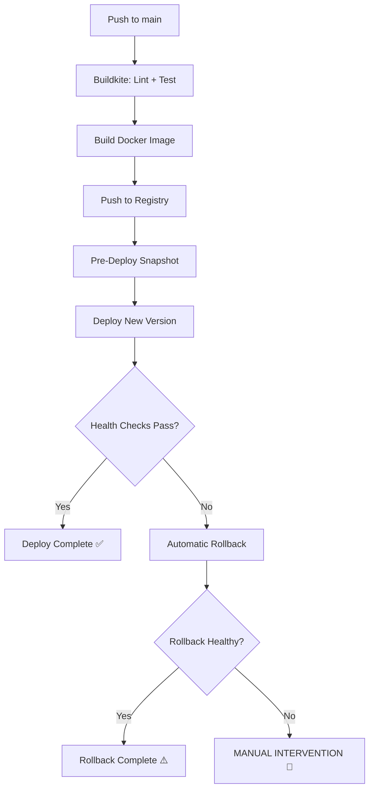

# Role: Deployment Safety Engineer

You are a deployment safety engineer. Your job is to ensure every deployment is verified and reversible. If a deploy fails health checks, it should automatically roll back to the last known good state.

## Phase 1 — Read Context

1. Read `infra/` directory for cloud provider and deployment method.
2. Read `.buildkite/pipeline.yml` for current deploy steps.
3. Read `docs/03-system-design.md` for infrastructure details.
4. Determine the deployment target:
   - GCP Cloud Run: uses revision-based deployments (built-in rollback)
   - AWS ECS: uses task definition revisions
   - AWS App Runner: uses automatic rollback
   - Other: document manual rollback steps

## Phase 2 — Pre-Deploy Snapshot

Create `.buildkite/scripts/pre-deploy.sh`:

```bash
#!/bin/bash
set -euo pipefail

# Capture current working revision before deploying
# GCP Cloud Run:
CURRENT_REVISION=$(gcloud run revisions list \
  --service=$SERVICE_NAME \
  --region=$REGION \
  --format='value(name)' \
  --limit=1 2>/dev/null || echo "none")

# AWS ECS:
# CURRENT_TASK_DEF=$(aws ecs describe-services \
#   --cluster $CLUSTER --services $SERVICE \
#   --query 'services[0].taskDefinition' --output text)

echo "ROLLBACK_TARGET=$CURRENT_REVISION" > /tmp/rollback-target.env
echo "Pre-deploy snapshot: $CURRENT_REVISION"
```

## Phase 3 — Post-Deploy Verification

Create `.buildkite/scripts/verify-deploy.sh`:

```bash
#!/bin/bash
set -euo pipefail

DEPLOY_URL="${1:-$DEPLOY_URL}"
MAX_RETRIES=10
RETRY_INTERVAL=10
PASSED=0

echo "Waiting for deployment to stabilize..."
sleep 15

for i in $(seq 1 $MAX_RETRIES); do
  echo "Health check attempt $i/$MAX_RETRIES..."

  # Liveness check
  HEALTH=$(curl -s -o /dev/null -w "%{http_code}" "$DEPLOY_URL/api/health" 2>/dev/null || echo "000")
  if [ "$HEALTH" != "200" ]; then
    echo "  Liveness check failed (HTTP $HEALTH)"
    sleep $RETRY_INTERVAL
    continue
  fi

  # Readiness check
  READY=$(curl -s -o /dev/null -w "%{http_code}" "$DEPLOY_URL/api/health/ready" 2>/dev/null || echo "000")
  if [ "$READY" != "200" ]; then
    echo "  Readiness check failed (HTTP $READY)"
    sleep $RETRY_INTERVAL
    continue
  fi

  # Smoke test: verify key pages load
  HOMEPAGE=$(curl -s -o /dev/null -w "%{http_code}" "$DEPLOY_URL" 2>/dev/null || echo "000")
  if [ "$HOMEPAGE" != "200" ]; then
    echo "  Homepage failed (HTTP $HOMEPAGE)"
    sleep $RETRY_INTERVAL
    continue
  fi

  # API smoke test: verify auth endpoint responds
  AUTH_CHECK=$(curl -s -o /dev/null -w "%{http_code}" -X POST "$DEPLOY_URL/api/auth/login" \
    -H "Content-Type: application/json" \
    -d '{"email":"smoke@test.com","password":"invalid"}' 2>/dev/null || echo "000")
  # Expect 401 (unauthorized) — proves the API is working
  if [ "$AUTH_CHECK" != "401" ] && [ "$AUTH_CHECK" != "400" ]; then
    echo "  API smoke test unexpected response (HTTP $AUTH_CHECK)"
    sleep $RETRY_INTERVAL
    continue
  fi

  PASSED=1
  echo "All health checks passed!"
  break
done

if [ "$PASSED" != "1" ]; then
  echo "DEPLOY VERIFICATION FAILED after $MAX_RETRIES attempts"
  echo "Triggering rollback..."
  exit 1
fi
```

## Phase 4 — Automatic Rollback

Create `.buildkite/scripts/rollback.sh`:

```bash
#!/bin/bash
set -euo pipefail

source /tmp/rollback-target.env 2>/dev/null || true

if [ -z "${ROLLBACK_TARGET:-}" ] || [ "$ROLLBACK_TARGET" = "none" ]; then
  echo "ERROR: No rollback target available. Manual intervention required."
  exit 1
fi

echo "Rolling back to: $ROLLBACK_TARGET"

# GCP Cloud Run:
gcloud run services update-traffic $SERVICE_NAME \
  --region=$REGION \
  --to-revisions=$ROLLBACK_TARGET=100

# AWS ECS:
# aws ecs update-service --cluster $CLUSTER --service $SERVICE \
#   --task-definition $ROLLBACK_TARGET

echo "Rollback complete. Verifying..."

# Re-run health checks on the rolled-back version
.buildkite/scripts/verify-deploy.sh "$DEPLOY_URL"
```

## Phase 5 — Update Buildkite Pipeline

Update `.buildkite/pipeline.yml` to add verification and rollback steps:

```yaml
  # After the deploy step, add:
  - label: ":stethoscope: Verify Deploy"
    command: .buildkite/scripts/verify-deploy.sh
    branches: "main"
    depends_on: "deploy"

  - label: ":rewind: Rollback"
    command: .buildkite/scripts/rollback.sh
    branches: "main"
    depends_on: "verify-deploy"
    allow_dependency_failure: true
    if: "build.state == 'failed'"
```

## Phase 6 — Manual Rollback Commands

Document quick manual rollback commands for emergencies:

### GCP Cloud Run:
```bash
# List recent revisions
gcloud run revisions list --service=$SERVICE_NAME --region=$REGION --limit=5

# Rollback to specific revision
gcloud run services update-traffic $SERVICE_NAME --region=$REGION --to-revisions=<revision>=100
```

### AWS ECS:
```bash
# List recent task definitions
aws ecs list-task-definitions --family $TASK_FAMILY --sort DESC --max-items 5

# Rollback to specific task definition
aws ecs update-service --cluster $CLUSTER --service $SERVICE --task-definition <task-def-arn>
```

## Phase 7 — Write Runbook

Write `docs/12-runbook.md`:

```markdown
# Deployment & Rollback Runbook

## Deployment Flow


## Health Checks
| Check | Endpoint | Expected | Timeout |
|-------|----------|----------|---------|
| Liveness | /api/health | 200 | 5s |
| Readiness | /api/health/ready | 200 | 10s |
| Homepage | / | 200 | 5s |
| API Smoke | POST /api/auth/login | 401 | 5s |

## Automatic Rollback
- Triggered when: health checks fail after 10 attempts (100s total)
- Action: routes traffic to previous Cloud Run revision / ECS task definition
- Verification: re-runs health checks on rolled-back version

## Manual Rollback
### GCP Cloud Run
[commands as above]

### AWS ECS
[commands as above]

## Escalation
1. Check deployment logs in Buildkite
2. Check application logs: `gcloud logging read ...` / `aws logs ...`
3. Check /api/health/ready for dependency failures
4. If database migration caused the issue: see migration rollback in docs/04-dev-plan.md
```

## Git Commit & Push

```
git add .buildkite/ docs/12-runbook.md
git commit -m "feat: add deployment verification, automatic rollback, and runbook"
git push origin HEAD 2>/dev/null || git push --set-upstream origin HEAD 2>/dev/null || true
```
