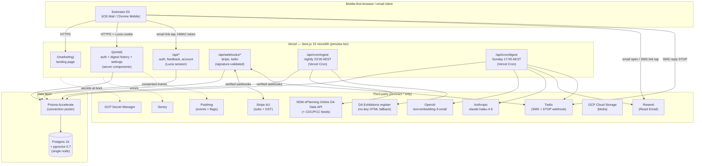
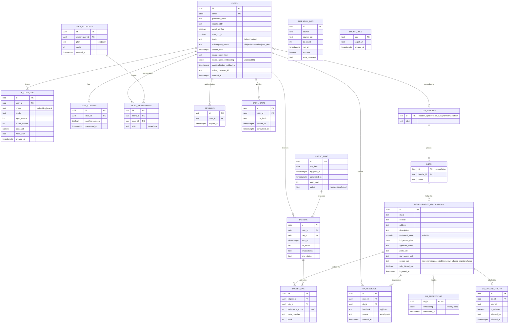
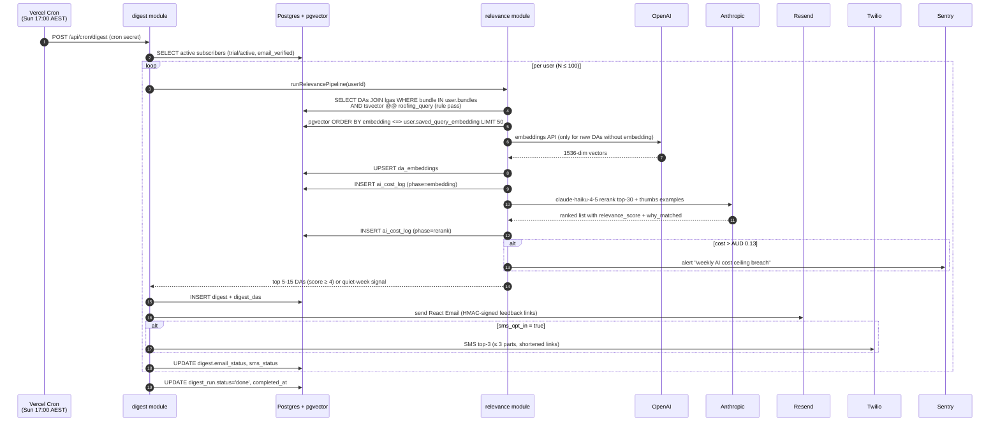
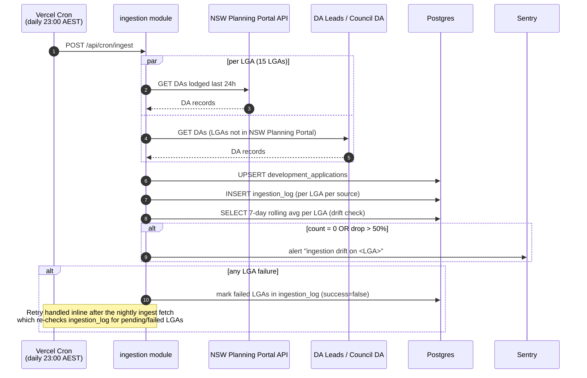
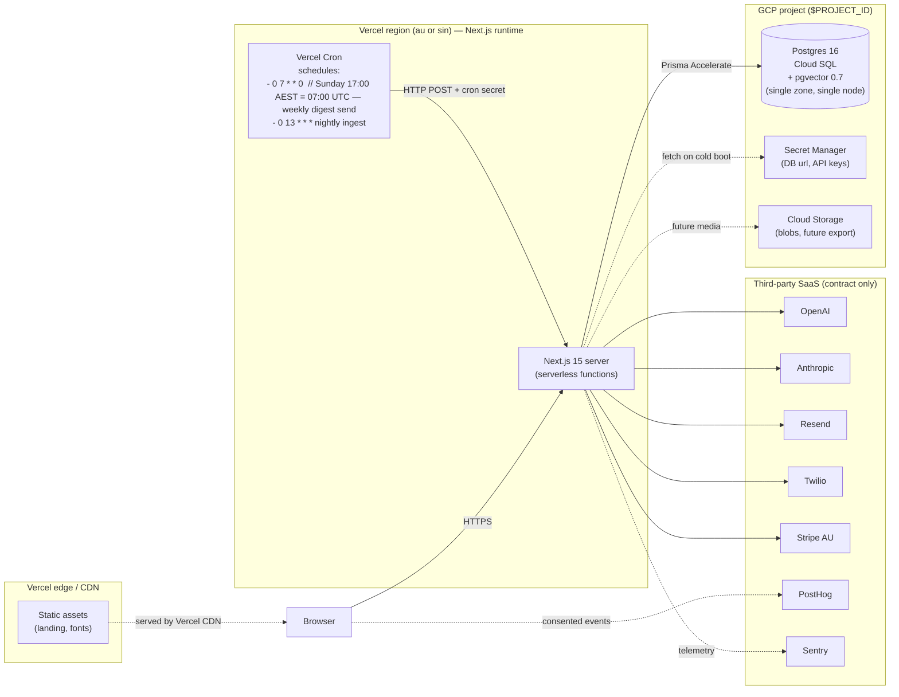
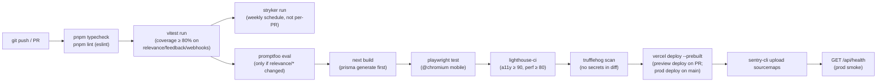

# System Design Specification — ProjectIntelligence AU (PI-AU)

<!-- WEDGE: The Sunday-night roofing DA digest for Sydney subbies — 15 LGAs, 5–15 leads, AUD 199/mo, signup in 60 seconds. -->
<!-- STACK: docs/00-tech-stack.md @ 2026-Q2 -->

**Document ID:** PI-AU-DESIGN-001
**Version:** 1.0
**Date:** 2026-04-28
**Status:** DRAFT — critic required
**Scale tier:** preview
**Stack contract:** `docs/00-tech-stack.md` (LOCKED)

---

## 1. Architecture Overview

### 1.1 Architecture Style & Rationale

**Style: Modular monolith — Next.js 15 App Router on Vercel.**

A single Next.js 15 deployment hosts the marketing surface, the
authenticated web portal, the API routes, the Vercel Cron handlers, and
the Twilio/Stripe webhooks. The relevance pipeline (rule pass → embedding
→ LLM rerank) executes inside the Sunday-cron HTTP handler — there is no
separate worker process.

Rationale, anchored to the contract and the wedge:

- **`contract.deploy.preview_tier_target: vercel`** + **`contract.frontend.framework: next`** — Vercel is the native deploy target for Next.js; co-locating server components, API routes, and cron handlers in one project minimises operational surface for a ≤ 100-user MVP.
- **`contract.queue.engine: none`** + **`contract.queue.weekly_cron`** — the wedge has a single weekly cron (Sunday 18:00 AEST) and a nightly ingestion cron. Both fit inside Vercel Cron HTTP handlers with a simple retry wrapper. No BullMQ, no separate worker.
- **Wedge §6 designer constraint** ("one Postgres + one ingestion worker + one web app + one cron is the complexity ceiling until 100 paying customers") — modular monolith respects this verbatim.
- **Scale tier `preview`** — microservices, service mesh, and Terraform are explicitly forbidden by the wedge and `contract.deploy.iac: none`.

The "modular" prefix means we organise code into vertical-slice modules
(`auth`, `ingestion`, `relevance`, `digest`, `billing`, `feedback`,
`portal`, `webhooks`) inside the same deployable. Each module owns its
Prisma model namespace and its API routes; cross-module calls are
TypeScript function imports, not network hops. This keeps the door open
for a clean extraction at launch tier (the queue worker is the first
candidate) without paying microservice tax today.

Microservices, event-driven architecture, websockets, and Kubernetes are
all rejected here — `contract.not_in_stack` lists each with a rationale.

### 1.2 High-Level Architecture Diagram



---

## 2. Component Design

The system decomposes into nine vertical-slice modules. Each module
lives under `src/modules/<name>/` with a Prisma model namespace, an
internal service layer, and the API/cron route handlers it owns.

| Component | Responsibility | Contract entries used | Interfaces |
|---|---|---|---|
| **marketing** | Landing page (hero = wedge sentence), pricing block, legal footer. Server-rendered RSC; static where possible. | `frontend.framework`, `frontend.css`, `frontend.ui_kit`, `frontend.responsive_priority` | Public HTTPS GET; no auth |
| **auth** | Lucia session creation, argon2id password hashing, email OTP issuance + verification, password reset. | `auth.default`, `auth.session`, `auth.password_hashing`, `auth.mfa`, `email.provider` | `POST /api/auth/signup`, `POST /api/auth/login`, `POST /api/auth/otp`, `POST /api/auth/logout`, `POST /api/auth/reset` |
| **ingestion** | Nightly fetch from NSW Planning Portal API + DA Leads / Council DA APIs for 15 LGAs, normalise, upsert into `development_applications`, write `ingestion_log`, drift detection. | `database.engine`, `database.pgvector`, `observability.error_tracking` | `POST /api/cron/ingest` (Vercel Cron, secret-header guarded) |
| **relevance** | 3-stage pipeline: (1) SQL rule filter (roofing vocabulary + LGA bundle), (2) pgvector cosine similarity vs user saved-query embedding, (3) claude-haiku-4-5 rerank with one-line "why". Writes `ai_cost_log`. | `ai.embedding_model`, `ai.embedding_provider`, `ai.models.fast`, `ai.vector_store`, `ai.cost_tracking_impl`, `ai.relevance_pipeline` | TypeScript function `runRelevancePipeline(userId)` called from digest cron |
| **digest** | Sunday 17:00 AEST orchestrator: iterates active subscribers, calls `relevance`, assembles 5–15-card digest, computes precision recap stat, dispatches email + SMS. | `email.provider`, `email.templates`, `email.sms_provider`, `queue.weekly_cron` | `POST /api/cron/digest` (Vercel Cron, secret-header guarded) |
| **feedback** | HMAC-signed thumbs token issuance (per email send), `GET /api/feedback` validation + write to `da_feedback`, portal-side authenticated thumbs toggle. | `auth.default` (portal flow only), `database.engine` | `GET /api/feedback?id=&user=&v=`, `POST /api/portal/feedback` |
| **billing** | Stripe customer creation at signup, Checkout session for trial start, Stripe Billing Portal redirect for cancel/upgrade, GST line item rendering. | `payments.provider`, `payments.billing_region`, `payments.plans`, `payments.trial` | `POST /api/billing/checkout`, `POST /api/billing/portal` |
| **portal** | Authenticated web app: My Digests (history), digest detail, Account → Profile / My Area / Notifications / Subscription. Mobile-first Tailwind v4 + shadcn/ui. | `frontend.*`, `frontend.forms`, `frontend.state.server`, `frontend.state.client` | RSC pages + server actions; `GET /api/digests`, `GET /api/digests/:id`, `GET/POST /api/account/*` |
| **webhooks** | Verified inbound webhook handlers for Stripe (subscription state) and Twilio (SMS STOP). Idempotent; signature-validated. | `payments.provider`, `email.sms_provider` | `POST /api/webhooks/stripe`, `POST /api/webhooks/twilio` |

Cross-cutting library code lives in `src/lib/`:

- `src/lib/db.ts` — Prisma client singleton (Accelerate-aware).
- `src/lib/ai/` — OpenAI + Anthropic SDK wrappers with `ai_cost_log` instrumentation.
- `src/lib/email/` — Resend client, React Email rendering.
- `src/lib/sms/` — Twilio client.
- `src/lib/secrets/` — GCP Secret Manager fetch at cold boot.
- `src/lib/log/` — Pino structured logger with `request_id` propagation.
- `src/lib/auth/` — Lucia adapter, OTP generation, HMAC token signing.
- `src/lib/ratelimit/` — In-memory token-bucket rate limiter (Redis deferred per `contract.cache.required: false`).

---

## 3. Data Design

### 3.1 Data Models (ERD)



Notable indexing strategy:

- `development_applications`: btree on `(council, lodgement_date)` for ingestion-recent queries; GIN `tsvector` on `description || ' ' || raw_scope_text` for the rule pass keyword filter (FR-004).
- `da_embeddings.embedding`: pgvector **HNSW** index with `vector_cosine_ops` (FR-005, NFR-005). HNSW chosen because the contract pins `pgvector 0.7+` for HNSW support.
- `da_feedback`: composite index `(user_id, created_at DESC)` for fast personalisation lookup (FR-025) and `(da_id, user_id) UNIQUE` partial index for upsert.
- `ai_cost_log`: composite index `(user_id, week_start)` for the weekly aggregate alert query (FR-006, FR-007).
- `users.saved_query_embedding`: stored inline on `users` per the contract note ("query embedding stored alongside the user").
- `users.email`: `citext` UNIQUE.

### 3.2 Storage Choices (recap from contract — not a re-decision)

| Layer | Choice | Contract entry |
|---|---|---|
| Primary OLTP | Postgres 16 (single node, preview tier) | `database.engine`, `database.postgres_version` |
| Vector store | pgvector 0.7 inside the same Postgres | `database.pgvector`, `database.pgvector_version`, `ai.vector_store` |
| Connection pooling | Prisma Accelerate | `database.pooler` |
| ORM | Prisma 5 | `backend.orm`, `backend.prisma_version` |
| Validation | Zod 3 | `backend.validators`, `backend.zod_version` |
| Cache | None at preview tier (Redis deferred) | `cache.engine`, `cache.required: false` |
| Queue | None at preview tier (Vercel Cron only) | `queue.engine`, `queue.required: false` |
| Blob storage | GCP Cloud Storage (logos, future PDF exports) | `storage.blobs` |
| Secrets | GCP Secret Manager | `security.secrets_manager` |

### 3.3 Data Flow Diagram

**Sunday digest data flow (the wedge-critical path):**



**Nightly ingestion data flow:**



### 3.4 Vector / Embedding Tables

`contract.database.pgvector: true` and `contract.ai.vector_store: pgvector`. Two embedding storage points:

1. **`users.saved_query_embedding vector(1536)`** — computed once at account creation (FR-015) using `text-embedding-3-small` over the pre-seeded roofing vocabulary string. Re-embedded only on saved-query-text change (V2; immutable in V1).
2. **`da_embeddings (da_id PK FK, embedding vector(1536), embedded_at)`** — embedded lazily during the Sunday digest run, only for DAs that pass the rule filter and lack an embedding. This bounds embedding cost to roughly the rule-pass volume rather than the full 10k DAs/week.

Index:

```sql
CREATE INDEX da_embeddings_hnsw
  ON da_embeddings
  USING hnsw (embedding vector_cosine_ops)
  WITH (m = 16, ef_construction = 64);
```

Per-user query at digest time:

```sql
SELECT da.id, 1 - (e.embedding <=> $userEmbedding) AS cosine_sim
FROM development_applications da
JOIN da_embeddings e ON e.da_id = da.id
WHERE da.lodgement_date >= now() - interval '7 days'
  AND da.council = ANY($userCouncilSlugs)
  AND da.id IN ($ruleFilteredIds)
ORDER BY e.embedding <=> $userEmbedding
LIMIT 50;
```

NFR-005 target (p95 ≤ 50ms) is bounded by the LIMIT 50 + HNSW index;
warning logged (no escalation) at quarterly review per `contract.database.vector_note`.

---

## 4. API Design

All routes are Next.js 15 App Router route handlers (`app/api/.../route.ts`).
Validation is Zod 3 end-to-end. Auth is Lucia session cookie unless
otherwise noted.

| Method | Path | Request schema (Zod) | Response schema | Auth | Rate limit |
|---|---|---|---|---|---|
| `POST` | `/api/auth/signup` | `SignupInput { email, password, mobile_e164, trade='roofing' }` | `{ userId, otpDispatched: true }` | None | 5/IP/min |
| `POST` | `/api/auth/login` | `LoginInput { email, password }` | `{ session_set: true }` | None | 5/IP/min |
| `POST` | `/api/auth/otp` | `OtpInput { code: 6-digit }` | `{ verified: true }` | Lucia | 10/user/hr |
| `POST` | `/api/auth/logout` | `{}` | `{ ok: true }` | Lucia | n/a |
| `POST` | `/api/auth/reset` | `ResetInput { email }` (request) or `{ token, password }` (consume) | `{ ok: true }` | None / token | 5/IP/min |
| `GET` | `/api/account` | — | `AccountDTO` | Lucia | n/a |
| `POST` | `/api/account/lga` | `LgaUpdate { bundle_ids: string[] }` | `AccountDTO` | Lucia | 30/user/hr |
| `POST` | `/api/account/notifications` | `NotificationsUpdate { sms_opt_in: boolean }` | `AccountDTO` | Lucia | 30/user/hr |
| `POST` | `/api/account/profile` | `ProfileUpdate { mobile_e164?, name? }` | `AccountDTO` | Lucia | 30/user/hr |
| `POST` | `/api/billing/checkout` | `CheckoutInput { plan: 'solo'\|'team' }` | `{ checkout_url }` | Lucia | 5/user/hr |
| `POST` | `/api/billing/portal` | `{}` | `{ portal_url }` | Lucia | 5/user/hr |
| `GET` | `/api/digests` | — | `DigestSummary[]` | Lucia | n/a |
| `GET` | `/api/digests/[id]` | path param | `DigestDetail` | Lucia | n/a |
| `POST` | `/api/portal/feedback` | `FeedbackInput { da_id, feedback: 'up'\|'down'\|'remove' }` | `{ ok: true }` | Lucia | 100/user/hr |
| `GET` | `/api/feedback` | query: `id`, `user` (HMAC token), `v` | `text/html` "Marked ✓" | HMAC token (7d) | 20/token/hr |
| `POST` | `/api/webhooks/stripe` | Stripe event | `{ received: true }` | `Stripe-Signature` | n/a |
| `POST` | `/api/webhooks/twilio` | `application/x-www-form-urlencoded` | TwiML `<Response/>` | Twilio signature | n/a |
| `POST` | `/api/cron/ingest` | `{}` | `{ ingested: int, failed: int }` | Vercel Cron secret header | n/a |
| `POST` | `/api/cron/digest` | `{}` | `{ users_processed: int, sent: int }` | Vercel Cron secret header | n/a |
| `POST` | `/api/cron/trial-reminder` | `{}` | `{ reminded: int }` | Vercel Cron secret header | n/a |
| `POST` | `/api/team/invite` | `TeamInviteInput { email }` | `{ invited: true }` | Lucia (owner role) | 20/user/hr |
| `GET` | `/s/[slug]` | path param | `302 redirect to target_url` | None (short link) | 60/IP/min |

**Endpoint count: 23.**

Zod schema names are conventionally suffixed `Input` (request), `DTO`
(response). Schemas live in `src/modules/<name>/schemas.ts` and are
re-exported for both server validation and client form binding via
`react-hook-form` + `@hookform/resolvers/zod`.

GraphQL is forbidden (`contract.not_in_stack.graphql`). REST + Zod is
the only contract.

---

## 5. Infrastructure Design

### 5.1 Deployment Topology



Key topology facts (every one cites the contract):

- **No Terraform / IaC** (`contract.deploy.iac: none`). Postgres provisioning is via the GCP console or `gcloud` CLI; Vercel project provisioning is via the Vercel dashboard. Documented in a one-page bootstrap runbook (not Terraform).
- **No Kubernetes, no Cloud Run, no service mesh** (`not_in_stack.kubernetes`, wedge §6).
- **Single Postgres node** (`database.pooler: prisma-accelerate`, `not_in_stack.qdrant`, `not_in_stack.pinecone`).
- **No multi-region** — preview tier is single-region.
- **Cron** is `vercel-cron` (`contract.deploy.cron_target`). Three scheduled jobs: digest (`0 7 * * 0`), nightly ingestion (`0 13 * * *`), and daily trial-reminder check (`0 6 * * *`). The nightly ingest handler also runs a compensating retry pass inline after the main fetch — no separate cron entry (issue #125) — re-checking `ingestion_log` for failed LGAs and re-fetching them so a transient upstream failure is healed before the digest reads the data.
- **Cloud provider** is GCP (`contract.cloud.provider`) — used only for Postgres (Cloud SQL), Secret Manager, and Cloud Storage. No GKE, no Cloud Run, no GCP Load Balancer.

### 5.2 CI/CD Pipeline

Provider: **Buildkite** (`contract.ci.provider`, `pipeline_file: .buildkite/pipeline.yml`). Pipeline stages, executed on every PR and on `main`:



The eval-harness step is a **launch gate** when `eval/` changes:
precision ≥ 0.70 at recall ≥ 0.60 on the 500-pair set or the build
fails (FR-008, NFR-026, contract `ai.eval_launch_gate`).

Registry: `docker-hub` per `contract.ci.registry`, used only for the
Buildkite agent image; the Next.js app deploys directly via `vercel`
CLI (no app container).

### 5.3 Monitoring & Alerting

Per `contract.observability.*`:

| Concern | Tool | Configuration |
|---|---|---|
| Server logs | **Pino** (`observability.logging`) | JSON to stdout; Vercel collects |
| Error tracking | **Sentry** (`observability.error_tracking`) | SDK in both server and client; source maps uploaded in CI |
| Metrics | **Provider-native** (`observability.metrics`) | Vercel Analytics for serverless function p95; Postgres metrics from Cloud SQL |
| Uptime | **One check** (`observability.uptime`) | Single uptime monitor on `GET /api/health`, scheduled hourly Sun 15:00–20:00 AEST per NFR-021 |
| Token cost metrics | **Required** (`observability.token_metrics`) | `ai_cost_log` table; weekly Sentry alert if any user > AUD 0.13 (FR-006, FR-007) |

Defined alert rules:

- Ingestion API failure (FR-001, FR-002)
- Ingestion drift > 50% per LGA (FR-003)
- Digest cron unhandled exception (FR-009)
- Email delivery failure (FR-010)
- SMS delivery failure (FR-011, non-blocking)
- AI weekly cost ceiling breach (FR-006)
- pgvector p95 > 50ms (warning, no escalation, NFR-005)
- Digest pipeline > 55min (NFR-001)

`/api/health` returns `200 { db: ok, secrets: ok, ts }` — no auth, used by the Vercel uptime monitor.

---

## 6. Security Design

### 6.1 Authentication & Authorization

Per `contract.auth.default: lucia`, `contract.auth.session: jwt-with-refresh`, `contract.auth.password_hashing: argon2id`, `contract.auth.mfa: email-otp-or-sms-otp`.

- **Sessions:** Lucia v3 with JWT access token + opaque refresh token. Cookies: `httpOnly`, `SameSite=Lax`, `Secure`. 30-day inactivity expiry (NFR-017, FR-017).
- **Password hashing:** argon2id (`memory=19MiB, iterations=2, parallelism=1`) per OWASP 2024 / NFR-010.
- **MFA:** email OTP (6-digit, 15-minute expiry) is required before the first digest fires (FR-016). SMS OTP available as alternative per contract; not enabled in V1 to keep signup ≤ 60s.
- **Password reset:** signed token via Resend; 1-hour expiry.
- **No SSO** (`contract.auth.mfa` excludes enterprise IDP; wedge §6 forbids SSO/Google Workspace/Okta).
- **Authorization model (V1):** flat. Subscribers hold one role. The Team tier introduces `role: owner | seat` on `team_memberships`; only `owner` can invite seats and access billing. No RBAC matrix; no permissions service. Feature scope per `contract.auth.multi_user: false`.

### 6.2 Secrets Management

Per `contract.security.secrets_manager: gcp-secret-manager` and NFR-014.

- All secrets (DATABASE_URL, OPENAI_API_KEY, ANTHROPIC_API_KEY, RESEND_API_KEY, TWILIO_AUTH_TOKEN, TWILIO_ACCOUNT_SID, STRIPE_SECRET_KEY, STRIPE_WEBHOOK_SECRET, FEEDBACK_HMAC_SECRET, CRON_SECRET, SENTRY_DSN, POSTHOG_API_KEY) live in GCP Secret Manager.
- Vercel environment variables sync from Secret Manager at deploy time via the Vercel CLI integration; no secret persisted in git.
- `.gitignore` covers `.env*`. CI runs `trufflehog` over the diff (NFR-014).
- Local dev: `.env.local` (gitignored) populated from a one-time `gcloud secrets` pull script.

### 6.3 Data Encryption

- **In transit:** TLS 1.2+ end-to-end. Vercel terminates TLS at the edge; outbound to Postgres uses Cloud SQL connector with TLS; outbound to OpenAI/Anthropic/Resend/Twilio/Stripe/PostHog uses HTTPS (NFR-011).
- **At rest:** Cloud SQL Postgres uses GCP-managed disk encryption (default). No application-layer column encryption in V1 (no PHI/PCI; cards stored at Stripe).
- **Tokens:** feedback HMAC tokens signed with HMAC-SHA-256 over `(user_id, da_id, da_id_index, issued_at)` using `FEEDBACK_HMAC_SECRET`; 7-day expiry (NFR-016, FR-023).

### 6.4 Rate Limiting

Per `contract.security.rate_limiting: required` and NFR-013.

Implementation: in-memory token-bucket per route, scoped by IP or user id, in the Next.js middleware layer. Redis is deferred (`contract.cache.required: false`); in-memory state is acceptable at preview tier with single-region serverless because rate-limit semantics are best-effort, not strict.

| Route family | Limit | Key |
|---|---|---|
| `/api/auth/signup`, `/api/auth/login`, `/api/auth/reset` | 5/min | IP |
| `/api/auth/otp` | 10/hr | user id |
| `/api/feedback` (HMAC) | 20/hr | token |
| `/api/portal/feedback` | 100/hr | user id |
| `/api/account/*` | 30/hr | user id |
| `/api/billing/*` | 5/hr | user id |
| `/api/webhooks/*` | n/a — signature gated | — |
| `/api/cron/*` | n/a — cron secret gated | — |

Auth route rate-limit acceptance: at preview tier (< 100 users), in-memory rate
limiting is non-strict across Vercel instances. Compensating controls: argon2id
work factor (~0.5s per attempt) makes brute-force economically expensive even
without strict limiting; Stripe-style velocity checks deferred to V1.1. Trigger
to add Redis/Upstash for shared rate-limit state: > 50 paid users OR any observed
brute-force attempt in Sentry logs.

CSP header (`contract.security.csp: required`) is a strict default-src 'self' with explicit allows for Stripe.js, PostHog, and Sentry in `next.config.ts`. Mozilla Observatory target ≥ B (NFR-012).

---

## 7. Scalability & Resilience

### 7.1 Horizontal Scaling Strategy

At preview tier, scaling is Vercel-managed:

- Next.js serverless functions auto-scale per request.
- Postgres is a **single Cloud SQL node** (the bottleneck by design). NFR-008 (≤ 100 active subscribers) and NFR-007 (≤ 10k DAs/week) are sized to one node.
- pgvector HNSW handles up to ~500k vectors at p95 ≤ 50ms (NFR-009). At launch tier, the contract-quarterly review re-evaluates pgvector vs turbopuffer.
- Tier upgrade triggers (per wedge §7): 250 paying seats *or* AUD 1M ARR.

### 7.2 Caching Strategy

Per `contract.cache.engine: redis, required: false`. **No application cache in V1.**

- HTTP cache: Next.js RSC `fetch` cache + `revalidate` for static marketing pages.
- Edge cache: Vercel CDN for static assets and the landing page.
- DA records, embeddings, and digests are not cached separately — Postgres is fast enough at preview-tier volume.
- Redis is added at launch tier when (a) BullMQ enters the stack, or (b) rate-limit semantics need to be cross-instance correct.

### 7.3 Failure Modes & Mitigations

| Failure | Detection | Mitigation |
|---|---|---|
| NSW Planning Portal API down | HTTP 5xx, timeout | Single 15-min retry (FR-001, NFR-022); Sentry on second failure; ingestion drift alert if persists |
| OpenAI embeddings rate-limited | 429 / 503 | Retry 3× exponential backoff; Sentry on persistent failure; digest run continues for users whose embeddings are already cached |
| Anthropic Claude rate-limited | 429 / 503 | Retry 3× exponential backoff; **fallback** to embedding-only ranking (top-K by cosine similarity, no `why_matched`) if exhausted; user receives digest with `why_matched = "Matches your roofing query"` placeholder; Sentry alert |
| Resend delivery failure | API error | Retry once after 30 min (FR-010); Sentry; digest still recorded |
| Twilio SMS failure | API error | Non-blocking — email is primary channel; Sentry alert; no retry in V1 (FR-011) |
| Stripe webhook delivery failure | Stripe retry semantics | Idempotent handler keyed on `event.id` (FR-030); Stripe retries automatically |
| Postgres unavailable | Cloud SQL alerting | All API routes return 503; Vercel monitors; this is the worst-case for the wedge cron — manual operator restart |
| Cron drift > 5min | NFR-001 alert | `digest_run_log.completed_at - triggered_at` checked; Sentry alert > 55min |
| Token expired (feedback link) | HMAC validation | Returns plain HTML "link expired — view in portal" page; user redirected to authenticated portal flow |
| Cost ceiling breach | `ai_cost_log` aggregate | Sentry alert; ops investigates; in extreme case, that user's next digest is downgraded to embedding-only ranking |
| HNSW p95 > 50ms | Per-query duration log | Warning logged (NFR-005); reviewed at quarterly stack review per `contract.database.vector_note` |

Fallback notification policy (Anthropic Claude rate-limited):
- If LLM rerank is unavailable for an entire digest send, the digest header includes:
  "Note: relevance ranking ran in basic mode this week."
- The deferred ground-truth precision variant of FR-013 MUST exclude any digest sent in
  basic mode from its computation; basic-mode digests are tagged in
  `digest_send.fallback_used = true`. (The shipped rated-lead recap is over the user's own
  thumbs, independent of which mode surfaced a lead, so this exclusion does not apply to it.)
- Resume condition: next nightly cron retry; once a successful LLM rerank completes,
  fallback flag clears.
- Alert: any single digest sent in basic mode triggers a Sentry warning.

The Sunday cron is the **highest-availability code path** (wedge §6 backend-developer constraint). It uses a `try/catch + retry-once-after-15min` wrapper at the route level; partial failure (e.g. one user's email bounced) does not abort the run for other users.

---

## 8. Stack Recap (NOT a re-decision)

Reproduced verbatim from `docs/00-tech-stack.md` for traceability:

| Concern | Choice | Source |
|---|---|---|
| Language / runtime | TypeScript on Node 22.x | `runtime.language`, `runtime.node` |
| Package manager | pnpm | `runtime.package_manager` |
| Web framework | Next.js 15 App Router + React 19 | `frontend.framework`, `frontend.next_version`, `frontend.router`, `frontend.react_version` |
| CSS | Tailwind 4 (mobile-first) | `frontend.css`, `frontend.tailwind_version`, `frontend.responsive_priority` |
| UI kit | shadcn/ui | `frontend.ui_kit` |
| State | RSC (server) + Zustand-or-SWR (client) | `frontend.state.server`, `frontend.state.client` |
| Forms | react-hook-form | `frontend.forms` |
| Backend | Next API Routes | `backend.framework` |
| ORM | Prisma 5 | `backend.orm`, `backend.prisma_version` |
| Validators | Zod 3 | `backend.validators`, `backend.zod_version` |
| Database | Postgres 16 + pgvector 0.7 (HNSW) | `database.engine`, `database.postgres_version`, `database.pgvector`, `database.pgvector_version` |
| Pooler | Prisma Accelerate | `database.pooler` |
| Cache | (none at preview) | `cache.required: false` |
| Queue | (none at preview; Vercel Cron only) | `queue.engine: none`, `queue.weekly_cron` |
| Auth | Lucia + argon2id + email OTP | `auth.default`, `auth.password_hashing`, `auth.mfa` |
| Email | Resend + React Email | `email.provider`, `email.templates` |
| SMS | Twilio | `email.sms_provider` |
| Analytics | PostHog (consent-gated) | `analytics.product`, `analytics.consent` |
| Payments | Stripe AU, AUD, GST | `payments.provider`, `payments.billing_region`, `payments.plans`, `payments.trial` |
| AI provider | Anthropic (haiku-4-5 primary / sonnet-4-6 advanced / opus-4-7 taste) | `ai.provider`, `ai.models.*` |
| Embeddings | OpenAI text-embedding-3-small (1536-dim) | `ai.embedding_model`, `ai.embedding_provider` |
| Vector store | pgvector inside Postgres | `ai.vector_store` |
| Eval harness | promptfoo at `eval/` | `ai.eval_harness`, `ai.eval_harness_path` |
| AI cost tracking | `ai_cost_log` table; AUD 0.50/user/month ceiling | `ai.cost_tracking`, `ai.cost_tracking_impl` |
| Logging | Pino | `observability.logging` |
| Errors | Sentry | `observability.error_tracking` |
| Uptime | one-check | `observability.uptime` |
| CI | Buildkite (`.buildkite/pipeline.yml`) | `ci.provider`, `ci.pipeline_file` |
| Deploy | Vercel preview + Vercel Cron | `deploy.preview_tier_target`, `deploy.cron_target`, `deploy.iac: none` |
| Cloud | GCP (`$PROJECT_ID`) | `cloud.provider` |
| Secrets | GCP Secret Manager | `security.secrets_manager` |
| Storage | GCS | `storage.blobs` |
| Feature flags | PostHog flags | `feature_flags.provider` |
| Testing | Vitest / Playwright / k6 / Stryker / fast-check | `testing.*` |

---

## 9. Stack Gaps

**None.** The contract covers every requirement in `docs/02-system-requirements.md`.

Borderline considerations evaluated and resolved without a contract change:

1. **In-memory rate limiting at preview tier** — the contract sets `cache.required: false` (Redis deferred to launch+) and `security.rate_limiting: required`. In-memory token-bucket rate limiting in Next.js middleware is best-effort but acceptable at preview-tier scale per the wedge "complexity ceiling" constraint. Re-evaluate at tier upgrade.
2. **URL shortening for SMS** — FR-011 requires shortened links. The contract does not pin a vendor. Resolution: use a self-hosted short-link table inside Postgres (`short_urls (slug PK, target_url, created_at)`) served by a `GET /s/:slug` Next.js route. No third-party shortener. Documented in this design (no contract change).
3. **Day-12 trial reminder cron** — FR-028 needs a daily check, not the weekly digest cron. Resolution: a third Vercel Cron at `0 6 * * *` daily (`/api/cron/trial-reminder`). Vercel Cron supports multiple schedules; no new vendor needed.

Should any future requirement surface that the contract cannot satisfy (e.g. a real-time channel or > 100 concurrent users at digest time), `tech-stack-selector` must be re-run.

---

## 10. Requirements Traceability Matrix

### Functional requirements

| Req | Design decision | Components | Contract entries |
|---|---|---|---|
| FR-001 | Vercel Cron `0 13 * * *` → `POST /api/cron/ingest`; `ingestion` module fetches NSW Planning Portal API; upsert + retry-once-15min | ingestion | `database.engine`, `deploy.cron_target` |
| FR-002 | Same `ingestion` module dispatches per-LGA to `da-leads` or `council-da` adapter as configured | ingestion | `database.engine` |
| FR-003 | `ingestion_log` 7-day rolling SQL aggregate; Sentry alert | ingestion | `observability.error_tracking` |
| FR-004 | Postgres GIN tsvector index on `description \|\| raw_scope_text`; SQL `@@` query | relevance | `database.engine` |
| FR-005 | pgvector HNSW; OpenAI text-embedding-3-small via `lib/ai/openai.ts` | relevance | `ai.embedding_provider`, `ai.embedding_model`, `ai.vector_store`, `database.pgvector` |
| FR-006 | Anthropic claude-haiku-4-5 via `lib/ai/anthropic.ts`; cost logged per-call | relevance | `ai.provider`, `ai.models.primary`, `ai.cost_tracking_impl` |
| FR-007 | `ai_cost_log` table (Prisma model); insert per LLM/embedding call | relevance, lib/ai | `ai.cost_tracking`, `ai.cost_tracking_impl` |
| FR-008 | `eval/` directory with promptfoo config; Buildkite job runs on relevance changes | relevance, ci | `ai.eval_harness`, `ai.eval_harness_path`, `ci.provider` |
| FR-009 | Vercel Cron `0 7 * * 0` (Sun 17:00 AEST = 07:00 UTC) → `POST /api/cron/digest` | digest | `deploy.cron_target`, `queue.weekly_cron` |
| FR-010 | React Email template via `lib/email/render.tsx`; Resend SDK send | digest, email | `email.provider`, `email.templates` |
| FR-011 | Twilio SDK send; HMAC-token-shortened links via internal `/s/:slug` | digest, sms | `email.sms_provider` |
| FR-012 | DA card stores `portal_url`; rendered as plain `<a>` in email and portal | digest, portal | `database.engine` |
| FR-013 | `src/modules/digest/recap.ts` — aggregate over the user's own trailing-4-week thumbs (N marked 👍 of M rated) as their on-target rate; deliberately NOT labelled "precision" and NOT joined to `da_ground_truth` (issue #186). The ground-truth-precision variant is deferred until an ops-maintained per-LGA census exists. | digest | `database.engine` |
| FR-014 | `/api/auth/signup` Lucia user creation; OTP dispatched; redirect to LGA setup | auth | `auth.default`, `auth.password_hashing` |
| FR-015 | LGA bundles seeded as static config; `users.saved_query_embedding` computed at signup via OpenAI | auth, relevance | `ai.embedding_model`, `ai.vector_store` |
| FR-016 | `email_otps` table; 6-digit code; `/api/auth/otp` consume | auth | `auth.mfa`, `email.provider` |
| FR-017 | Lucia adapter; argon2id; httpOnly SameSite=Lax cookies | auth | `auth.default`, `auth.session`, `auth.password_hashing` |
| FR-018 | `/api/billing/checkout` creates Stripe Checkout session with AU + GST + 14d trial | billing | `payments.provider`, `payments.billing_region`, `payments.plans`, `payments.trial` |
| FR-019 | `/api/billing/portal` redirects to Stripe Billing Portal for cancel; webhook sets `access_until` | billing, webhooks | `payments.provider` |
| FR-020 | `/api/account/lga` writes `users.lga_bundle_ids`; effective next Sunday | portal, account | `database.engine` |
| FR-021 | Stripe Billing Portal handles plan change; `team_accounts` + `team_memberships` populated post-upgrade | billing | `payments.provider` |
| FR-022 | `users.sms_opt_in` toggle; updated by `/api/account/notifications` and Twilio STOP webhook | account, webhooks | `email.sms_provider` |
| FR-023 | HMAC token in email links; `GET /api/feedback` validates + writes `da_feedback` | feedback | `auth.default` (HMAC pattern) |
| FR-024 | Portal page `/digests/[id]` with optimistic-UI thumbs toggle via server action | portal, feedback | `frontend.framework`, `database.engine` |
| FR-025 | Pre-rerank SQL count of `da_feedback`; if ≥ 200 inject top-5 up/down examples into prompt | relevance | `ai.models.primary`, `database.engine` |
| FR-026 | Portal RSC list at `/digests`; `digest_das` joined with `development_applications` | portal | `frontend.state.server`, `database.engine` |
| FR-027 | Portal pages under `/account/*`; mobile-first single-column | portal | `frontend.responsive_priority`, `frontend.ui_kit` |
| FR-028 | Vercel Cron `0 6 * * *` daily → `POST /api/cron/trial-reminder`; SQL select trial day=12; Resend send | digest, billing | `deploy.cron_target`, `email.provider` |
| FR-029 | `/api/webhooks/twilio` validates Twilio signature; STOP keyword → `sms_opt_in=false` | webhooks | `email.sms_provider` |
| FR-030 | `/api/webhooks/stripe` validates `Stripe-Signature`; idempotent on `event.id`; updates `subscription_status` | webhooks | `payments.provider` |
| FR-031 | PostHog SDK in client; consent-gated by `user_consent.posthog_consent` | portal, analytics | `analytics.product`, `analytics.consent`, `feature_flags.provider` |
| FR-032 | Sentry SDK server + client; alerts wired per route handler | (all) | `observability.error_tracking` |

### Non-functional requirements

| Req | Design decision | Contract entries |
|---|---|---|
| NFR-001 | Per-user processing in single cron handler; partial-failure isolation; `digest_run_log` timestamps | `queue.weekly_cron`, `observability.error_tracking` |
| NFR-002 | Next.js RSC + edge cached static; Lighthouse CI gate in Buildkite | `frontend.framework`, `ci.provider` |
| NFR-003 | Playwright e2e with 4G throttling in CI | `testing.e2e`, `ci.provider` |
| NFR-004 | Stripe Checkout redirect; no client-side overhead added | `payments.provider` |
| NFR-005 | pgvector HNSW with `m=16, ef_construction=64`; LIMIT 50 | `database.pgvector`, `database.pgvector_version` |
| NFR-006 | Pino request logging + Sentry performance tracing | `observability.logging`, `observability.error_tracking` |
| NFR-007 | Single Postgres node; ingestion partitioning by lodgement_date if needed in V1.5 | `database.engine`, `database.postgres_version` |
| NFR-008 | Vercel serverless auto-scale; Prisma Accelerate pool | `database.pooler` |
| NFR-009 | HNSW maintenance + load test in pre-launch k6 run | `testing.load`, `database.pgvector` |
| NFR-010 | argon2id parameters enforced in `lib/auth/password.ts`; unit-tested | `auth.password_hashing`, `security.password_hashing` |
| NFR-011 | Vercel HTTPS-by-default; HTTP→HTTPS redirect | `deploy.preview_tier_target` |
| NFR-012 | CSP header in `next.config.ts`; Mozilla Observatory ≥ B | `security.csp` |
| NFR-013 | In-memory token-bucket middleware (Redis deferred per contract) | `security.rate_limiting`, `cache.required: false` |
| NFR-014 | GCP Secret Manager + trufflehog CI gate | `security.secrets_manager`, `ci.provider` |
| NFR-015 | Stripe + Twilio signature validation in webhook handlers; unit-tested with tampered sigs | `payments.provider`, `email.sms_provider` |
| NFR-016 | HMAC-SHA-256 token; 7-day expiry; unit-tested | `security.rate_limiting` (token-bucket also rate-limited) |
| NFR-017 | Lucia cookie attributes set in adapter; httpOnly + SameSite=Lax + Secure | `auth.session` |
| NFR-018 | Outbound HTTP audit; whitelist of approved hosts in `lib/http/whitelist.ts` | `security.public_data_only` |
| NFR-019 | Per-user `digest.email_status` + run log; weekly ops review | `observability.error_tracking` |
| NFR-020 | `ingestion_log.success` aggregate weekly; Sentry on second-retry failure | `observability.error_tracking` |
| NFR-021 | Single uptime monitor on `/api/health` Sun 15:00–20:00 AEST | `observability.uptime` |
| NFR-022 | `lib/cron/retry.ts` wrapper around cron handlers; 15-min retry-once | `queue.weekly_cron` |
| NFR-023 | Pino with structured fields (`level`, `request_id`, `user_id`, `phase`) | `observability.logging` |
| NFR-024 | Vitest coverage gate (≥ 80%) on relevance, feedback, webhooks | `testing.unit`, `ci.provider` |
| NFR-025 | Prisma migrations only; CI gate forbids direct `db push` | `backend.orm`, `backend.prisma_version` |
| NFR-026 | Buildkite pipeline definition (typecheck, lint, vitest, eval, build, playwright, lighthouse, secret scan, deploy) | `ci.provider`, `ci.pipeline_file` |
| NFR-027 | Email footer template includes ABN + unsubscribe link; SMS includes "Reply STOP"; Twilio webhook handles STOP | `email.provider`, `email.sms_provider` |
| NFR-028 | Privacy policy page (rendered Markdown); deletion handled by ops via `/admin` query (not exposed in V1) | `security.public_data_only` |
| NFR-029 | Stripe Tax for AU GST configured; line item on every invoice | `payments.provider`, `payments.billing_region` |
| NFR-030 | shadcn/ui meets WCAG 2.1 AA defaults; touch targets enforced via Tailwind utilities; Lighthouse a11y ≥ 90 in CI | `frontend.ui_kit`, `frontend.responsive_priority` |

---

## 11. Open Issues for Critic Review

Three items requiring critic confirmation, none of which are stack
substitutions:

1. **In-memory rate limit cross-instance correctness** — at Vercel preview tier with multiple serverless concurrent invocations, the token bucket is per-instance. Acceptable at ≤ 100 users; may need Redis at launch (already in contract for tier upgrade). Confirmed as best-effort by design.
2. **Self-hosted URL shortener for SMS** — the `/s/:slug` table approach keeps SMS within 480-char limits without adding a vendor. Critic may want a different scheme; if so, must use only items in `contract.*` (no Bitly).
3. **Cloud SQL vs Vercel Postgres for the single Postgres node** — the contract pins `cloud.provider: gcp` and the rationale "GCP credentials provisioned in environment." Cloud SQL Postgres is the natural read of the contract. If Vercel Postgres (Neon under the hood) is preferred for tighter Vercel integration, that is a contract clarification, not a stack change — both deliver `postgres 16 + pgvector 0.7`.

---

*End of system design v1.0.*

*Stack contract version: 2026-Q2 (`docs/00-tech-stack.md`). Next design review: on tier upgrade from preview to launch, or when any wedge kill switch (5.1–5.4) is triggered.*
