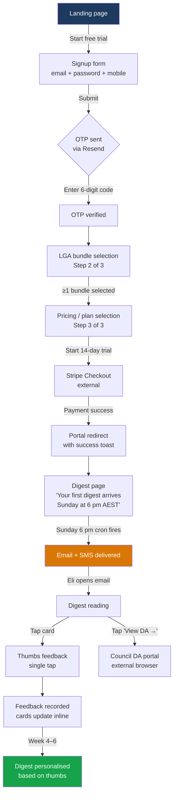
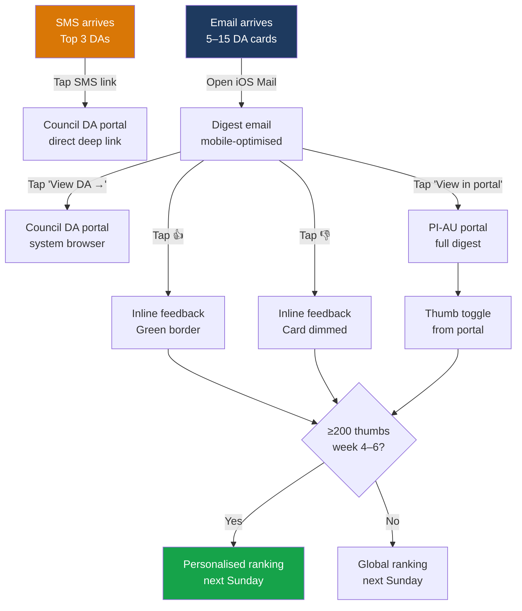
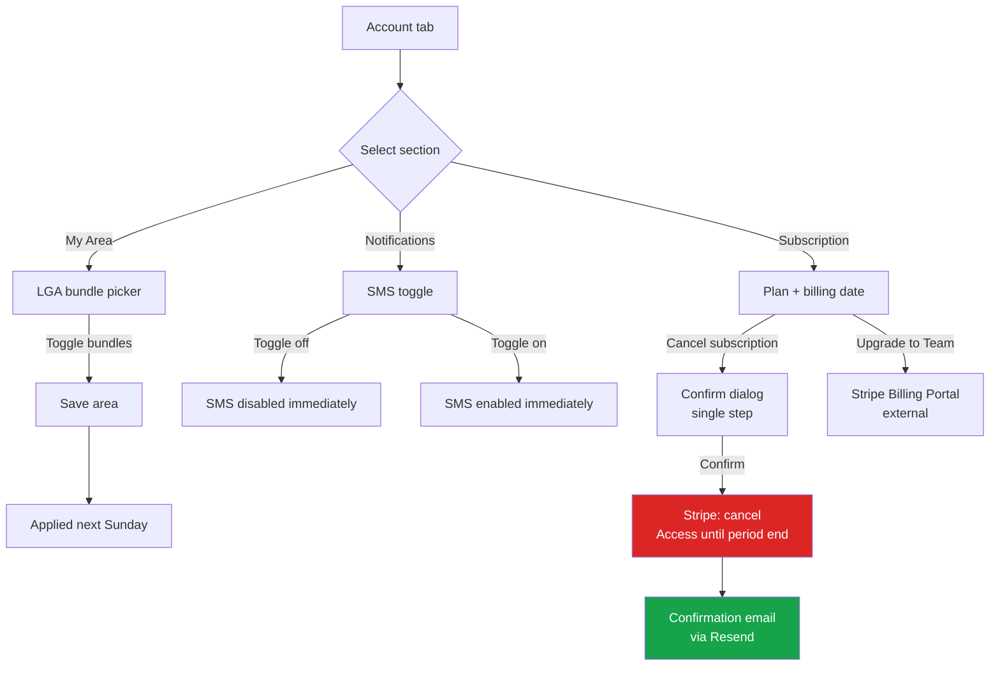

<!-- WEDGE: The Sunday-night roofing DA digest for Sydney subbies — 15 LGAs, 5–15 leads, AUD 199/mo, signup in 60 seconds. -->

# UX Design System — ProjectIntelligence AU (PI-AU)

**Document ID:** PI-AU-UX-001
**Version:** 1.0
**Date:** 2026-04-28
**Status:** DRAFT — critic required
**Scale tier:** preview
**Stack contract:** `docs/00-tech-stack.md` (LOCKED — Tailwind 4, shadcn/ui, Next.js 15 App Router, mobile-first)

---

## Competitor Teardown Summary

Three competitors analysed (full teardowns in `dogfood/competitor-teardown/`):

| Competitor | Palette | Mobile | Key Gap |
|---|---|---|---|
| Cordell/Cotality | Coral + cream (rebrand) | Linearised desktop; no sticky CTA | No self-serve; no Sunday-night cadence; database browser not a digest |
| BCI/Hubexo | Orange-red + white | Desktop-only UX; contact data blurred | Triage burden on buyer; no trade-specific relevance |
| EstimateOne | Navy + emerald green | Above-fold holds, below-fold sparse | Head-contractor tenders only; no DA-stage; no weekly push cadence |

**Design counter-position:** Avoid coral (Cotality), avoid navy+emerald (E1), avoid orange-red (BCI). Use a palette that reads well on a dark phone screen on a Sunday evening. Lead with digest format and cadence specificity — not a database browser. Surface full data (no redaction paywall). Make thumb interaction the signature micro-interaction.

---

## 1. Design Principles

### P1 — Sunday Evening, Not Monday Morning
Every screen is designed for the moment Eli is in the ute at 6 pm Sunday, iOS Mail open, one thumb free. High contrast, large tap targets, content density that allows a 5-minute digest scan without pinching or scrolling sideways. Desktop is the secondary surface.

### P2 — Lead with the List, Not the Platform
The hero is always the digest preview — not a dashboard, not a chart, not a stat card. When a user opens the portal, the first thing they see is this week's DA cards. The product *is* the list.

### P3 — Friction is Cordell's Moat
Every interaction that requires more than one tap on mobile is a point of departure. Thumb up/down = one tap. Click-through to DA = one tap. SMS opt-in = one toggle. No modals for simple actions. No hover-only states.

### P4 — Proof, Not Promise
The precision recap stat ("you saw 12 of 13 real re-roofs this month") is a first-class UI element from week 4. The design reserves a prominent slot for it above the DA cards. Never bury the proof metric in a settings page.

### P5 — Quiet Confidence
The voice is direct, terse, trade-aware. No marketing superlatives in the product UI. "12 leads this week, Western Sydney + Hills" over "Discover amazing roofing opportunities!" Button labels are verbs: "View DA", "Start trial", "Save area", not "Get Started!" or "Learn More".

---

## 2. Colour Palette

### 2a. Brand Palette

**Design rationale:** We avoid coral (Cotality), navy/emerald (EstimateOne), and orange-red (BCI). We need a palette that:
- Reads at high contrast on a phone in a dark ute
- Feels professional but not corporate-grey
- Differentiates from incumbents
- Works in email (no opacity layers, no CSS variables in React Email)

Chosen anchor: **Slate blue** primary (authority, trust, cool contrast to construction-industry oranges) with **Amber/gold** accent (urgency, lead-signal colour, warm contrast on dark surfaces). Both are absent from all three competitors.

```
Primary:   Slate Blue   #1E3A5F    (deep navy-leaning slate — distinct from E1's pure navy)
Accent:    Amber Gold   #D97706    (warm urgency; construction-adjacent; 3:1+ on white at large size)
Success:   Forest Green #16A34A
Warning:   Amber        #D97706    (shared with accent — intentional; leads are "warm")
Error:     Red          #DC2626
Info:      Sky Blue     #0284C7
```

### 2b. Full Colour Scale with WCAG AA Notes

#### Slate Blue Scale (primary brand)
| Token | Hex | Use |
|---|---|---|
| `slate-50` | `#F0F4F8` | Page background (portal), card fill on light mode |
| `slate-100` | `#D9E2EC` | Dividers, input borders at rest |
| `slate-200` | `#BCCCDC` | Disabled state borders |
| `slate-300` | `#9FB3C8` | Placeholder text, secondary labels |
| `slate-400` | `#829AB1` | Secondary text |
| `slate-500` | `#627D98` | Body text (light bg) — contrast 4.6:1 on white ✓ AA |
| `slate-600` | `#486581` | Secondary headings |
| `slate-700` | `#334E68` | Primary headings, high-emphasis text — contrast 7.9:1 ✓ AAA |
| `slate-800` | `#243B53` | Dark card headers, nav items |
| `slate-900` | `#102A43` | Hero text on light bg — contrast 14.1:1 ✓ AAA |
| `slate-950` | `#0A1E30` | Footer, deepest dark surface |

#### Amber/Gold Scale (accent)
| Token | Hex | Use |
|---|---|---|
| `amber-50` | `#FFFBEB` | Warning background tint |
| `amber-100` | `#FEF3C7` | Warning bg, hover tint on amber buttons |
| `amber-400` | `#FBBF24` | Icon fills, decorative accent |
| `amber-500` | `#F59E0B` | Accent hover state |
| `amber-600` | `#D97706` | Primary CTA bg (white text: 3.1:1 — acceptable at 18px+ bold; use slate-900 text on amber at smaller sizes) |
| `amber-700` | `#B45309` | Pressed/active CTA state — white text 4.7:1 ✓ AA |
| `amber-900` | `#78350F` | Dark amber text on light bg — 9.2:1 ✓ AAA |

#### Neutral Scale
| Token | Hex | Use |
|---|---|---|
| `neutral-50` | `#FAFAFA` | Alt background, email bg |
| `neutral-100` | `#F5F5F5` | Card background (email), tag bg |
| `neutral-200` | `#E5E5E5` | Input border at rest, dividers |
| `neutral-300` | `#D4D4D4` | Disabled input border |
| `neutral-400` | `#A3A3A3` | Placeholder, icon muted |
| `neutral-500` | `#737373` | Secondary body text — 4.6:1 ✓ AA on white |
| `neutral-700` | `#404040` | Primary body text — 10.7:1 ✓ AAA on white |
| `neutral-900` | `#171717` | Heading, high-contrast text |
| `neutral-950` | `#0A0A0A` | Near-black for dark surfaces |

#### Semantic Colours
| Role | Hex | On-colour text | Contrast | WCAG |
|---|---|---|---|---|
| Success bg | `#DCFCE7` | `#14532D` | 12.1:1 | ✓ AAA |
| Success text on white | `#16A34A` | white inverse | 4.5:1 | ✓ AA |
| Warning bg | `#FEF3C7` | `#78350F` | 10.4:1 | ✓ AAA |
| Error bg | `#FEE2E2` | `#7F1D1D` | 11.9:1 | ✓ AAA |
| Error text on white | `#DC2626` | white (large only) | 3.2:1 | large ✓ |
| Info bg | `#E0F2FE` | `#0C4A6E` | 10.8:1 | ✓ AAA |

**WCAG AA summary:** All body text combinations meet 4.5:1. All large text (≥18px regular or ≥14px bold) meets 3:1. The amber-600 on white (3.1:1) is used only at CTA button size (≥16px bold) where 3:1 applies. Amber-700 on white reaches 4.7:1 covering all sizes.

---

## 3. Typography Scale

**CSS framework:** Tailwind 4 with `frontend.ui_kit: shadcn-ui`.
**Strategy:** Single font family (Inter) for both heading and body — avoids a second HTTP request, Inter is variable font (one file covers all weights), excellent legibility at small sizes on mobile. Monospace for DA IDs and code snippets.

### Font Families
```
--font-sans:  "Inter", ui-sans-serif, system-ui, -apple-system, sans-serif
--font-mono:  "JetBrains Mono", "Fira Code", ui-monospace, monospace
```

Inter is available via Google Fonts; pin to variable font `wght 300..700` for a single HTTP request. Self-host via `next/font/google` with `display: swap`.

### Type Scale (mobile-first base sizes)

| Token | Mobile | Desktop (`md:`) | Weight | Line-h | Use |
|---|---|---|---|---|---|
| `text-xs` | 12px / 0.75rem | 12px | 400 | 1.4 | Label, tag, timestamp |
| `text-sm` | 14px / 0.875rem | 14px | 400 | 1.5 | Secondary body, metadata |
| `text-base` | 16px / 1rem | 16px | 400 | 1.6 | Primary body copy |
| `text-lg` | 18px / 1.125rem | 18px | 500 | 1.5 | DA card title, section intro |
| `text-xl` | 20px / 1.25rem | 20px | 600 | 1.4 | Card heading, dialog title |
| `text-2xl` | 24px / 1.5rem | 24px | 700 | 1.3 | Page heading (H2) |
| `text-3xl` | 28px / 1.75rem | 30px | 700 | 1.2 | Section heading (H1 portal) |
| `text-4xl` | 32px / 2rem | 36px | 800 | 1.15 | Marketing hero headline |
| `text-5xl` | 36px / 2.25rem | 48px | 800 | 1.1 | Landing page hero (large) |

### Letter Spacing
```
tracking-tight:  -0.025em   (headings text-3xl+)
tracking-normal:  0em        (body)
tracking-wide:    0.05em     (all-caps labels, badge text)
```

### Font Weights in Use
- **300** — not used (Inter 300 blurs on low-DPI Android)
- **400** — body copy, secondary text
- **500** — DA card title, navigation labels
- **600** — section headings, button labels
- **700** — page titles, strong emphasis
- **800** — hero headlines only (marketing landing page)

---

## 4. Spacing & Layout System

**Base unit:** 4px (Tailwind default). All spacing is a multiple of 4px.

### Spacing Scale in Use
```
space-1   =  4px   touch-target padding minimum complement
space-2   =  8px   compact inline spacing
space-3   = 12px   tag/badge padding
space-4   = 16px   base component padding, card inner
space-5   = 20px   form field gap
space-6   = 24px   section gutter (mobile)
space-8   = 32px   section gutter (tablet+)
space-10  = 40px   section vertical spacing
space-12  = 48px   major section breaks
space-16  = 64px   hero padding (landing)
```

### Touch Targets (WCAG 2.5.5)
All interactive elements — thumb buttons, nav links, toggle switches — must have a minimum hit area of 44×44px. Use `min-h-[44px] min-w-[44px]` Tailwind utilities. Visible element may be smaller (e.g. icon); use padding to expand the hit area.

### Container Widths
```
Mobile:   100% with px-4 (16px side padding)
sm:       640px max (sm:max-w-xl, rare — most UI is full-bleed on mobile)
md:       768px max (digest card two-column starts here)
lg:       1024px max (portal main content area)
xl:       1280px max (marketing landing page hero)
Content:  max-w-3xl (672px) for prose/settings flows
```

### Breakpoints (Tailwind 4 default)
```
sm:   640px
md:   768px
lg:   1024px
xl:   1280px
2xl:  1536px
```
Tailwind prefix order (per contract §5): `base (mobile) → sm → md → lg → xl`

### Grid
- **Digest cards:** Single column (`grid-cols-1`) mobile → two columns (`md:grid-cols-2`) at 768px+
- **Portal sidebar layout:** Single column mobile → sidebar + main (`lg:grid-cols-[240px_1fr]`) at 1024px+
- **Marketing hero:** Stacked mobile → two-column (`md:grid-cols-2`) at 768px+

### Border Radius
```
rounded-sm:   2px   (input borders)
rounded:      4px   (badges, tags)
rounded-md:   6px   (cards, buttons)
rounded-lg:   8px   (dialog, sheet)
rounded-xl:  12px   (hero image, feature card)
rounded-full: 9999px (avatar, pill badge)
```

---

## 5. Component Inventory

All components are shadcn/ui primitives with PI-AU token overrides applied via Tailwind theme config. Only variants in active use for V1 wedge flows are listed; `[V2]` variants are noted but not specced.

### 5a. Buttons

| Variant | Use | Mobile behaviour |
|---|---|---|
| `primary` | "Start free trial", "Save area", "Confirm cancel" | Full-width on mobile (`w-full`), auto-width `md:w-auto` |
| `secondary` | "View all digests", "Back", "Edit" | Full-width mobile where paired with primary |
| `ghost` | Inline text actions, nav links | Min 44px height touch target |
| `destructive` | "Cancel subscription" confirm | Full-width mobile |
| `icon-only` | Thumb up / thumb down on DA card | 44×44px tap target always; icon 20×20px |

**Sizes:** `sm` (32px h) for inline compact use; `md` (40px h, default); `lg` (48px h) for primary CTAs on mobile.

**Thumb buttons (signature component):**
```
ThumbButton {
  size:     44×44px tap target, 40×40px visible circle
  icon:     ThumbsUp / ThumbsDown (Lucide, 20px)
  states:   default (neutral-300 bg, neutral-700 icon)
             active-up (green-100 bg, green-700 icon, check overlay)
             active-down (red-100 bg, red-700 icon, check overlay)
             loading (skeleton pulse)
  animation: scale 0.95 on press (150ms), color transition (150ms)
  label:     sr-only "Thumb up for [DA address]" / "Thumb down for [DA address]"
}
```

### 5b. Forms

| Component | Variant | Notes |
|---|---|---|
| Input | default, error, disabled | 48px height mobile, 40px `md:` |
| PasswordInput | with eye toggle | Toggle button = 44×44 target |
| OTPInput | 6-digit grid | 6 × 48px cells, auto-advance |
| Select | LGA bundle picker | Multi-select with checkbox list; sheet on mobile |
| Switch | SMS opt-in toggle | 44px height hit area; label on left |
| Checkbox | Terms at signup | 24px visible, 44px hit area |
| PhoneInput | AU +61 mobile | Country prefix pre-filled, locked to AU |

### 5c. Navigation

**Mobile portal:** Bottom tab bar (4 tabs: Digest, History, Settings, Account). No sidebar on mobile.
**Desktop portal (`lg:`):** Left sidebar, 240px fixed, collapsible to icon-only at `lg:`.
**Marketing:** Top nav bar, sticky, hamburger menu on mobile.

Tab bar items (mobile portal):
```
Tab 1: Digest      (digest icon)  → /portal/digest (current week)
Tab 2: History     (clock icon)   → /portal/digests
Tab 3: My Area     (map icon)     → /portal/account/area
Tab 4: Account     (user icon)    → /portal/account
```

### 5d. DA Card (core component)

The digest card is the most important component. It must be scannable in under 5 seconds on a phone.

```
DACard {
  layout:    Full-width mobile, ~50% at md:grid-cols-2
  structure:
    [Header row]  LGA badge (amber)  |  Relevance score pip (1–5 dots)
    [Address]     text-lg font-medium (e.g. "12 Acacia Ave, Penrith NSW 2750")
    [Value]       text-sm text-slate-500 ("Est. AUD 180k" or "Value not disclosed")
    [Why]         text-sm italic text-slate-600 ("Existing dwelling re-roof, Colorbond replacement")
    [Scope]       text-sm text-neutral-700 (≤2 sentences from description)
    [Applicant]   text-xs text-neutral-400 "Applicant: Smith & Partners Architects"
    [Footer row]  [View DA →] ghost-link  |  [👍] [👎] thumb buttons
  padding:   p-4 (16px all sides)
  border:    border border-neutral-200 rounded-md
  shadow:    shadow-sm
  states:    default | thumbed-up (green left border 3px) | thumbed-down (neutral-300 left border) | loading (skeleton)
}
```

### 5e. Data Display

| Component | Use |
|---|---|
| `DigestHeader` | Week date, lead count, precision recap (from week 4) |
| `PrecisionBadge` | "93% precision · 4-week avg" — amber badge with tooltip |
| `LGABadge` | Small coloured pill per LGA, amber-100 bg, amber-900 text |
| `RelevanceScore` | 5 pip dots filled left-to-right; 1–5 mapped from score 0–10 |
| `StatCard` | Billing/account stats — plan, next charge, seat count |
| `SkeletonCard` | DA card loading state — full card shape skeleton |

### 5f. Feedback & Overlay

| Component | Variant | Notes |
|---|---|---|
| Toast | success, error, info | Bottom of screen on mobile (above tab bar), top-right `md:` |
| Alert | inline, page-level | For "quiet week" message, trial expiry warning |
| Dialog | confirm only | Cancel subscription confirmation; no complex dialogs |
| Sheet | mobile-only | LGA picker, SMS settings on mobile (slides up from bottom) |
| Tooltip | desktop-only | Relevance score explanation; not on mobile (tap = no hover) |

### 5g. Layout Shells

```
MarketingShell:   sticky top nav + full-width content + footer
PortalShell:      bottom tab bar (mobile) OR left sidebar (lg:) + main content area
AuthShell:        centered card, max-w-sm, vertically centered, marketing-nav stripped
```

---

## 6. Motion & Interaction

### Transition Durations
```
fast:    150ms   (hover states, button press, thumb animation, toggle)
normal:  300ms   (sheet open/close, dialog, toast enter/exit)
slow:    500ms   (page transition fade — used sparingly)
```

### Easing
```
ease-out:       cubic-bezier(0, 0, 0.2, 1)   — elements entering screen
ease-in:        cubic-bezier(0.4, 0, 1, 1)   — elements leaving screen
ease-in-out:    cubic-bezier(0.4, 0, 0.2, 1) — toggle, scale transforms
```

### Loading States
- **Skeleton loaders** for DA cards: same card dimensions, pulsing neutral-200 blocks
- **Spinner** (24px) for button loading state (inline, replaces label)
- **Page-level skeleton:** 3 skeleton DA cards visible on first load before data arrives
- Skeleton pulse: `animate-pulse` Tailwind class, 1.5s cycle

### Hover/Focus/Active (desktop)
```
Button:   hover bg-shade-10-darker (150ms), focus ring (2px amber-600 offset-2), active scale-95
Card:     hover shadow-md (150ms), no colour change (cards are not clickable — only footer actions)
Link:     underline on hover (150ms), focus ring amber-600
Input:    focus border-slate-700 (150ms), focus ring slate-700 offset-2
Thumb:    hover bg-green-50/red-50 (150ms), active scale-95 (150ms)
```

### Reduced Motion
```css
@media (prefers-reduced-motion: reduce) {
  * { transition-duration: 0.01ms !important; animation-duration: 0.01ms !important; }
}
```
Applied globally in `globals.css`. Skeleton loaders become static neutral-200 fill. No page transitions.

---

## 7. Wireframes — All Wedge Workflow Screens

### 7.1 Landing Page (Marketing)

```
┌─────────────────────────────────────────────────────────┐
│ [Logo: PI-AU]                     [Log in] [Start trial]│  ← sticky nav, mobile: hamburger
├─────────────────────────────────────────────────────────┤
│                                                         │
│  The Sunday-night roofing DA digest   [crane photo     ]│  ← md: two-column hero
│  for Sydney subbies — 15 LGAs,        [right half     ]│
│  5–15 leads, AUD 199/mo,                               │
│  signup in 60 seconds.                                  │
│                                                         │
│  [████████ Start free trial ████████]                  │  ← full-width mobile CTA, amber primary
│  No sales call. 14-day trial. Cancel anytime.          │
│                                                         │
├─────────────────────────────────────────────────────────┤
│  ┌──────────────┐  ┌──────────────┐  ┌──────────────┐ │  ← 3 feature blocks (stacked mobile, 3-col md:)
│  │ 15 Sydney LGAs│  │ Re-roof vocab│  │ 60s signup   │ │
│  │ one Sunday   │  │ not keywords │  │ no sales call │ │
│  │ email + SMS  │  │              │  │               │ │
│  └──────────────┘  └──────────────┘  └──────────────┘ │
├─────────────────────────────────────────────────────────┤
│  PRICING                                                │
│  ┌─────────────────────┐  ┌─────────────────────┐      │  ← stacked mobile, side-by-side md:
│  │ Solo                │  │ Team                │      │
│  │ AUD 199/mo          │  │ AUD 499/mo          │      │
│  │ 1 seat              │  │ 3 seats             │      │
│  │ [Start 14-day trial]│  │ [Start 14-day trial]│      │
│  └─────────────────────┘  └─────────────────────┘      │
│  All prices + GST. No lock-in.                         │
├─────────────────────────────────────────────────────────┤
│  Footer: ABN · Privacy · Terms · © 2026 PI-AU          │
└─────────────────────────────────────────────────────────┘

MOBILE (375px):
┌─────────────────────┐
│ [PI-AU Logo]    [☰] │
├─────────────────────┤
│ The Sunday-night    │
│ roofing DA digest   │
│ for Sydney subbies  │
│ — 15 LGAs, 5–15     │
│ leads, AUD 199/mo,  │
│ signup in 60 secs.  │
│                     │
│ [Start free trial]  │  ← full-width, 48px, amber
│ No sales call.      │
│ 14-day trial.       │
│ Cancel anytime.     │
├─────────────────────┤
│ [Feature block 1]   │
│ [Feature block 2]   │
│ [Feature block 3]   │
├─────────────────────┤
│ [Pricing: Solo]     │
│ [Pricing: Team]     │
├─────────────────────┤
│ [Footer]            │
└─────────────────────┘
```

### 7.2 Signup Flow (SF-1.1)

```
┌─────────────────────────────────────────┐
│ ← Back to home   [PI-AU Logo] Step 1/4 │  ← AuthShell, max-w-sm centered
├─────────────────────────────────────────┤
│                                         │
│  Start your 14-day trial               │
│  No sales call.                         │
│                                         │
│  Email address                          │
│  [______________________________]       │  ← 48px input mobile
│                                         │
│  Password                               │
│  [______________________________] [👁]  │
│                                         │
│  Mobile (AU)                            │
│  [+61] [___________________________]   │  ← locked country prefix
│                                         │
│  Trade                                  │
│  [████ Roofing ▼] (pre-selected, locked)│
│                                         │
│  ☐ I agree to the Terms and Privacy    │  ← 44px hit area
│                                         │
│  [████████ Create account ████████]    │  ← full-width amber primary
│                                         │
│  Already have an account? Log in →     │
└─────────────────────────────────────────┘

MOBILE (375px): identical layout, single column
```

### 7.3 Email OTP Verification

```
┌─────────────────────────────────────────┐
│        [PI-AU Logo]      Step 2 of 4   │
├─────────────────────────────────────────┤
│                                         │
│  Check your email                       │
│                                         │
│  We sent a 6-digit code to             │
│  eli@example.com                        │
│                                         │
│  [ _ ] [ _ ] [ _ ] [ _ ] [ _ ] [ _ ]  │  ← OTP grid, 48px cells, auto-advance
│                                         │
│  [██████ Verify email ██████]          │  ← disabled until 6 digits entered
│                                         │
│  Didn't get it? Resend code (60s)      │
│                                         │
└─────────────────────────────────────────┘
```

### 7.4 LGA Bundle Selection (SF-1.2)

```
┌─────────────────────────────────────────┐
│             [PI-AU Logo]   Step 3 of 4 │
├─────────────────────────────────────────┤
│                                         │
│  Choose your service area               │
│  Pick the LGA bundles you work in.      │
│  You can change this anytime.           │
│                                         │
│  ┌─────────────────────────────────┐   │  ← selectable card, 44px+ touch area
│  │ ☐ Western Sydney               │   │  Penrith, Blacktown, Parramatta,
│  │   Penrith · Blacktown · Parra  │   │  Cumberland, The Hills
│  └─────────────────────────────────┘   │
│  ┌─────────────────────────────────┐   │
│  │ ☐ Inner West & City            │   │
│  │   Inner West · City of Sydney  │   │
│  └─────────────────────────────────┘   │
│  ┌─────────────────────────────────┐   │
│  │ ☐ Northern Sydney              │   │
│  │   Hornsby · Ku-ring-gai · more │   │
│  └─────────────────────────────────┘   │
│  ┌─────────────────────────────────┐   │
│  │ ☐ Southern Sydney              │   │
│  │   Sutherland · St George · more│   │
│  └─────────────────────────────────┘   │
│                                         │
│  [████████ Continue ████████]          │  ← disabled until ≥1 selected
│                                         │
└─────────────────────────────────────────┘

Selected state: card has amber left border (3px) + amber-50 bg + check icon
```

### 7.5 Stripe Checkout / Pricing (SF-1.3)

```
┌─────────────────────────────────────────┐
│             [PI-AU Logo]   Step 4 of 4 │
├─────────────────────────────────────────┤
│                                         │
│  Choose your plan                       │
│  14-day free trial. Cancel anytime.    │
│                                         │
│  ┌─────────────────────────────────┐   │  ← tappable card (active: amber border)
│  │ ● Solo                         │   │
│  │   AUD 199/mo + GST             │   │
│  │   1 seat · All 15 LGAs         │   │
│  └─────────────────────────────────┘   │
│  ┌─────────────────────────────────┐   │
│  │ ○ Team                         │   │
│  │   AUD 499/mo + GST             │   │
│  │   3 seats · All 15 LGAs        │   │
│  └─────────────────────────────────┘   │
│                                         │
│  [████ Start 14-day trial ████]        │  → Stripe Checkout redirect
│                                         │
│  Your card is not charged for 14 days. │
│  First digest arrives Sunday 6 pm AEST.│
│                                         │
└─────────────────────────────────────────┘
```

### 7.6 Portal — Current Digest (CF-1, Primary View)

```
MOBILE (375px) — PRIMARY TARGET:
┌─────────────────────────────────────────┐
│ ProjectIntelligence                [👤] │  ← page header, no sidebar
├─────────────────────────────────────────┤
│ Your Digest · 27 Apr 2026              │  ← DigestHeader
│ 12 leads · Western Sydney + Hills      │
│ ┌───────────────────────────────────┐  │  ← PrecisionBadge (week 4+)
│ │ 93% precision · last 4 weeks ⓘ  │  │    amber badge
│ └───────────────────────────────────┘  │
├─────────────────────────────────────────┤
│ ┌─────────────────────────────────────┐│  ← DA Card 1
│ │ [Western Sydney]  [●●●●○]          ││   LGA badge + 4/5 relevance
│ │                                     ││
│ │ 12 Acacia Ave, Penrith NSW 2750    ││   address (text-lg)
│ │ Est. AUD 180k                       ││   value (text-sm slate-500)
│ │                                     ││
│ │ "Existing dwelling re-roof,         ││   why (italic text-sm slate-600)
│ │ Colorbond replacement"              ││
│ │                                     ││
│ │ Demolition of existing tiled roof  ││   scope (text-sm neutral-700)
│ │ and installation of Colorbond       ││
│ │ metal deck roofing system...        ││
│ │                                     ││
│ │ Applicant: Smith & Partners Arch.  ││   applicant (text-xs neutral-400)
│ │                                     ││
│ │ [View DA →]          [👍]  [👎]    ││   footer row
│ └─────────────────────────────────────┘│
│                                         │
│ ┌─────────────────────────────────────┐│  ← DA Card 2
│ │ [Hills District]  [●●●○○]          ││
│ │ ...                                 ││
│ └─────────────────────────────────────┘│
│                                         │
│ ┌─────────────────────────────────────┐│  ← DA Cards 3–12 render inline
│ │ [Western Sydney]  [●●●●○]          ││   (no pagination — wedge promises
│ │ ...                                 ││    "5–15 leads, scannable in 5 min";
│ └─────────────────────────────────────┘│    P2 "Lead with the List").
│   ⋮ (cards 4–12 stacked, same shape)  │   Telemetry tracks scroll-depth;
│                                         │   if median fold ≤ card 6 over 4
│ ┌─────────────────────────────────────┐│   weeks, revisit (Open Issue #5).
│ │ [Inner West]      [●●●○○]          ││
│ │ ...                                 ││
│ └─────────────────────────────────────┘│
│                                         │
│ ─── End of digest · 12 leads ───       │  ← terminal divider, slate-400 text-xs
│                                         │
├─────────────────────────────────────────┤
│ [🗞 Digest] [📋 History] [📍 Area] [👤]│  ← bottom tab bar, 44px min-h
└─────────────────────────────────────────┘

DESKTOP (1024px+):
┌──────────────────────────────────────────────────────────────┐
│ [PI-AU Logo]                                      [Eli P. ▼] │
├────────────────────┬─────────────────────────────────────────┤
│ Digest             │  Your Digest · 27 Apr 2026              │
│ History            │  12 leads · Western Sydney + Hills       │
│ My Area            │  [93% precision · last 4 weeks ⓘ]      │
│ ─────────────      ├─────────────────────────────────────────┤
│ Account            │  ┌──────────────┐  ┌──────────────┐    │
│ Billing            │  │ DA Card 1    │  │ DA Card 2    │    │
│                    │  └──────────────┘  └──────────────┘    │
│ [SMS: ON  ◑]      │  ┌──────────────┐  ┌──────────────┐    │
│                    │  │ DA Card 3    │  │ DA Card 4    │    │
│                    │  └──────────────┘  └──────────────┘    │
│                    │                                          │
└────────────────────┴─────────────────────────────────────────┘
```

### 7.7 Digest History (SF-2.2 portal view)

```
MOBILE:
┌─────────────────────────────────────────┐
│ ProjectIntelligence                [👤] │
├─────────────────────────────────────────┤
│ Digest History                          │
├─────────────────────────────────────────┤
│ ┌─────────────────────────────────────┐│
│ │ 27 Apr 2026 · 12 leads              ││  ← tappable row → opens digest detail
│ │ Western Sydney + Hills              ││
│ │ [93% precision]                     ││
│ └─────────────────────────────────────┘│
│ ┌─────────────────────────────────────┐│
│ │ 20 Apr 2026 · 8 leads               ││
│ └─────────────────────────────────────┘│
│ ┌─────────────────────────────────────┐│
│ │ 13 Apr 2026 · 14 leads              ││
│ └─────────────────────────────────────┘│
│                                         │
├─────────────────────────────────────────┤
│ [🗞 Digest] [📋 History] [📍 Area] [👤]│
└─────────────────────────────────────────┘
```

### 7.8 Triage with Thumbs (within DA Card — interaction detail)

```
DEFAULT STATE:
│ [View DA →]                  [👍]  [👎] │
│                              neutral  neutral

AFTER THUMB UP (within 150ms, no page reload):
│ [View DA →]          [✓ Marked]  [👎] │  ← thumbed-up card gets green left border
│                      green bg    muted

AFTER THUMB DOWN:
│ [View DA →]     [👍]   [✓ Marked]    │  ← thumbed-down: card slightly dim (opacity-75)
│                 muted   red bg

TOGGLE (tap again to remove):
│ Tapping an active thumb removes it (returns to neutral)
│ Confirmation: none required (no undo modal)
```

### 7.9 Settings — SMS Opt-in (SF-3.4)

```
MOBILE:
┌─────────────────────────────────────────┐
│ ← Account          Notifications        │
├─────────────────────────────────────────┤
│                                         │
│ Sunday SMS digest                       │
│ Top 3 leads via SMS at 6 pm AEST       │
│ (mobile: +61 4XX XXX XXX)             │
│                                  [◑ ON]│  ← Switch, 44px hit area, amber when on
│                                         │
│ Reply STOP to any SMS to opt out.      │
│                                         │
├─────────────────────────────────────────┤
│ [🗞 Digest] [📋 History] [📍 Area] [👤]│
└─────────────────────────────────────────┘
```

### 7.10b Cancel Subscription — Confirm Dialog (SF-3.5)

```
MOBILE (modal sheet, slides up from bottom):
┌─────────────────────────────────────────┐
│ Account                          ✕      │  ← settings page beneath, dimmed
│                                         │
│ ┏━━━━━━━━━━━━━━━━━━━━━━━━━━━━━━━━━━━━━┓│  ← AlertDialog (Radix), centered
│ ┃                                      ┃│   max-w-sm, rounded-xl, white card
│ ┃   Cancel your subscription?         ┃│   text-lg semibold slate-900
│ ┃                                      ┃│
│ ┃   You'll keep digest access until   ┃│   text-sm slate-700, leading-relaxed
│ ┃   Sun 24 May 2026.                  ┃│   ↑ dynamic: end of current period
│ ┃                                      ┃│
│ ┃   Your saved LGAs and feedback      ┃│
│ ┃   history stay for 90 days, then    ┃│
│ ┃   we delete them.                   ┃│
│ ┃                                      ┃│
│ ┃  ┌────────────────────────────────┐ ┃│   Destructive primary
│ ┃  │   Cancel subscription          │ ┃│   bg-error #DC2626 (white text,
│ ┃  └────────────────────────────────┘ ┃│   contrast 4.6:1 — passes AA)
│ ┃                                      ┃│   48px h, full-width
│ ┃  ┌────────────────────────────────┐ ┃│   Secondary (safe default)
│ ┃  │        Keep my plan            │ ┃│   bg-white border slate-300
│ ┃  └────────────────────────────────┘ ┃│   focus-visible by default
│ ┃                                      ┃│   (Esc / scrim tap dismisses)
│ ┗━━━━━━━━━━━━━━━━━━━━━━━━━━━━━━━━━━━━━┛│
└─────────────────────────────────────────┘

DESKTOP (1024px+): identical AlertDialog, max-w-md, centered overscrim.

INTERACTION:
- Trigger: "Cancel subscription" link in /account/billing (slate-500
  text-sm, underlined on hover — *not* a button — matches P3 "give
  cancellation the same dignity as signup").
- Default focus on dismount: "Keep my plan" (safe default, prevents
  accidental Enter-to-confirm).
- Confirm fires `DELETE /api/billing/subscription` → Stripe
  `cancel_at_period_end=true` → toast "Cancelled. You're good until
  Sun 24 May." → redirect to /account.
- Toast persists 8s, includes [Undo] action that POSTs reactivate.
- No "are you sure?" double-confirm (single AlertDialog is the confirm).
- No surprise downsell, no exit-intent popover, no "tell us why" form
  (per P5 Quiet Confidence — exit telemetry only).
```

### 7.10 Account Settings — My Area (SF-3.2)

```
MOBILE:
┌─────────────────────────────────────────┐
│ ← Account             My Service Area  │
├─────────────────────────────────────────┤
│                                         │
│ Your digest covers these LGA bundles:  │
│                                         │
│ ┌──────────────────────────────────┐   │
│ │ ✓ Western Sydney                │   │  ← selected (amber border + bg)
│ └──────────────────────────────────┘   │
│ ┌──────────────────────────────────┐   │
│ │ ○ Inner West & City             │   │
│ └──────────────────────────────────┘   │
│ ┌──────────────────────────────────┐   │
│ │ ✓ Hills District                │   │
│ └──────────────────────────────────┘   │
│ ┌──────────────────────────────────┐   │
│ │ ○ Southern Sydney               │   │
│ └──────────────────────────────────┘   │
│                                         │
│ Changes apply from next Sunday's digest│
│                                         │
│ [████████ Save area ████████]          │
│                                         │
├─────────────────────────────────────────┤
│ [🗞 Digest] [📋 History] [📍 Area] [👤]│
└─────────────────────────────────────────┘
```

---

## 8. User Flow Diagrams

### 8.1 Wedge Critical Path — Signup to First Digest



### 8.2 Digest Reading Flow (Sunday Evening, Mobile)



### 8.3 Account Settings Flows



---

## 9. Responsive Strategy

### Mobile-First Approach (per contract §5)

All Tailwind utility classes are written at the base (mobile) breakpoint first. Larger breakpoints use `sm:`, `md:`, `lg:`, `xl:` prefixes to progressively enhance.

**Never use `max-md:` to hide things from mobile.** Design for mobile, add for desktop.

### Breakpoint Behaviour by Screen

| Component | Mobile (base) | Tablet (`md:` 768px) | Desktop (`lg:` 1024px) |
|---|---|---|---|
| Navigation | Bottom tab bar (4 tabs) | Bottom tab bar | Left sidebar (240px) |
| DA card grid | Single column, full-width | Two columns (auto grid) | Two columns (sidebar layout) |
| Auth screens | Full-width, max-w-sm card | max-w-sm card centered | max-w-sm card centered |
| LGA picker | Full-width stacked cards | Two-column grid | Two-column grid in sidebar layout |
| Buttons (primary) | `w-full` | `w-full` or `w-auto` | `w-auto` |
| Hero (landing) | Single column | Two-column (image right) | Two-column |
| Pricing cards | Stacked | Side by side | Side by side |
| Tooltips | Hidden (use info icon → sheet) | Visible on hover | Visible on hover |

### iOS Mail Constraint
The Sunday email digest renders in iOS Mail where:
- CSS Grid is not supported: use `<table>` layout for email (React Email handles this)
- No JavaScript: thumbs feedback via plain HTML links (`/api/feedback?id=X&user=Y&v=1`)
- Max width ~600px: single column is the only safe layout
- Dark mode in iOS Mail: test with explicit background-color on all containers

### Email Digest Layout (not Tailwind — React Email table layout)
```
Email width:  600px max, 100% on mobile
Background:   #FAFAFA (neutral-50)
Content bg:   #FFFFFF
Card border:  1px solid #E5E5E5
CTA button:   48px height, #1E3A5F bg, white text, border-radius 6px
Thumb links:  44px × 44px linked images (plain anchor + inline-block img)
Font:         Arial, Helvetica, sans-serif (email safe)
```

---

## 10. Accessibility Requirements

### WCAG 2.1 AA Compliance Checklist

#### Perceivable
- [x] **1.1.1 Non-text content:** All images have `alt` text. Thumb icons have `aria-label`. Skeleton loaders have `aria-label="Loading digest"`.
- [x] **1.3.1 Info and relationships:** Semantic HTML throughout — `<nav>`, `<main>`, `<article>` (DA cards), `<button>`, `<h1>`–`<h3>` hierarchy. No `div` used for interactive elements.
- [x] **1.3.3 Sensory characteristics:** Instructions do not rely on colour alone. Thumb "marked" state includes text "Marked ✓", not only colour change.
- [x] **1.4.1 Use of colour:** Relevance score pip dots include `aria-label="Relevance: 4 of 5"`.
- [x] **1.4.3 Contrast (Minimum):** All body text ≥4.5:1 (verified in §2). Large text ≥3:1.
- [x] **1.4.4 Resize text:** Layout holds to 200% text size without horizontal scroll.
- [x] **1.4.5 Images of text:** No text in images.
- [x] **1.4.10 Reflow:** Single-column layout at 320px (mobile base) — no horizontal scroll.
- [x] **1.4.11 Non-text contrast:** UI components (input borders, button outlines) ≥3:1.
- [x] **1.4.13 Content on hover:** Tooltips remain visible on hover; closeable via Escape.

#### Operable
- [x] **2.1.1 Keyboard:** All interactive elements reachable via Tab. No keyboard traps. Modal focus traps correctly (shadcn Dialog uses Radix UI which handles this).
- [x] **2.1.2 No keyboard trap:** Escape closes all modals, sheets, tooltips.
- [x] **2.4.1 Bypass blocks:** Skip-to-main-content link as first focusable element.
- [x] **2.4.2 Page titled:** All pages have `<title>` set via Next.js metadata API.
- [x] **2.4.3 Focus order:** DOM order matches visual order. No CSS `order` property reordering.
- [x] **2.4.4 Link purpose:** All links have descriptive text or `aria-label`. "View DA →" includes DA address in `aria-label`.
- [x] **2.4.7 Focus visible:** Focus ring visible on all interactive elements (amber-600, 2px, offset-2).
- [x] **2.5.3 Label in name:** Button `aria-label` contains visible text.
- [x] **2.5.5 Target size:** All touch targets ≥44×44px (enforced via Tailwind `min-h-[44px] min-w-[44px]`).

#### Understandable
- [x] **3.1.1 Language of page:** `<html lang="en-AU">`.
- [x] **3.2.1 On focus:** No context change on focus.
- [x] **3.2.2 On input:** No context change on input (LGA toggle saves on explicit "Save area" tap, not on change).
- [x] **3.3.1 Error identification:** Form errors identified in text, not colour only. `aria-describedby` links input to error message.
- [x] **3.3.2 Labels or instructions:** All form inputs have visible `<label>`.

#### Robust
- [x] **4.1.1 Parsing:** Valid HTML; Next.js App Router produces standards-compliant markup.
- [x] **4.1.2 Name, role, value:** All components use ARIA roles correctly. shadcn/ui Radix primitives handle this for complex components.
- [x] **4.1.3 Status messages:** Toast messages use `role="status"` (success/info) or `role="alert"` (error). Screen reader announces without focus move.

### Keyboard Navigation Patterns

| Component | Tab behaviour | Enter/Space | Escape | Arrow keys |
|---|---|---|---|---|
| DA Card thumbs | Tab to 👍, Tab to 👎 | Activate | — | — |
| LGA bundle cards | Tab through each | Toggle select | — | — |
| OTP inputs | Auto-advance on digit entry | — | — | ← → navigate cells |
| Bottom tab bar | Tab through 4 tabs | Navigate to section | — | ← → switch tabs |
| SMS toggle | Tab to switch | Toggle | — | — |
| Dialog (cancel confirm) | Focus trapped; Tab cycles Cancel/Confirm | Activate | Close | — |
| Sheet (mobile LGA picker) | Focus trapped | Activate | Close | — |

### Screen Reader Announcements for Dynamic Content

```typescript
// Thumb feedback — announce after POST completes
// Use aria-live="polite" region near thumb buttons
<span aria-live="polite" className="sr-only">
  {thumbState === 'up' ? `Thumbs up recorded for ${daAddress}` :
   thumbState === 'down' ? `Thumbs down recorded for ${daAddress}` :
   thumbState === 'removed' ? `Feedback removed for ${daAddress}` : ''}
</span>

// Toast notifications — role="status" for success, role="alert" for error
<div role="alert" aria-live="assertive">Error sending feedback. Try again.</div>
<div role="status" aria-live="polite">Area saved. Takes effect next Sunday.</div>

// Loading states
<div aria-label="Loading your digest" aria-busy="true">
  {/* skeleton cards */}
</div>
```

### Focus Management

- **Page navigation:** On route change, focus moves to `<main>` heading (`h1`).
- **Dialog open:** Focus moves to first focusable element inside dialog.
- **Dialog close:** Focus returns to the element that triggered it.
- **Sheet (mobile):** Same as dialog; close button is last focusable element before loop.
- **Toast:** Does not move focus (non-blocking; screen reader announces via live region).
- **Thumb action:** Focus remains on thumb button after toggle (no focus jump).

### Reduced Motion
```css
/* globals.css */
@media (prefers-reduced-motion: reduce) {
  *, *::before, *::after {
    animation-duration: 0.01ms !important;
    transition-duration: 0.01ms !important;
    scroll-behavior: auto !important;
  }
}
```

---

## 11. Tailwind Theme Config

Tailwind 4 uses CSS-native config. The following block goes in `app/globals.css` (Tailwind 4 `@theme` directive) and also exports as a TypeScript object for use in `tailwind.config.ts` compatibility shim if needed.

```css
/* app/globals.css — Tailwind 4 @theme block */
@import "tailwindcss";

@theme {
  /* Brand colours */
  --color-brand-50:  #EEF2F7;
  --color-brand-100: #D4DDE8;
  --color-brand-200: #A9BBCF;
  --color-brand-300: #7E99B6;
  --color-brand-400: #53779D;
  --color-brand-500: #2E5580;
  --color-brand-600: #1E3A5F;   /* primary */
  --color-brand-700: #162C47;
  --color-brand-800: #0F1E2F;
  --color-brand-900: #070F18;
  --color-brand-950: #030810;

  --color-accent-50:  #FFFBEB;
  --color-accent-100: #FEF3C7;
  --color-accent-200: #FDE68A;
  --color-accent-300: #FCD34D;
  --color-accent-400: #FBBF24;
  --color-accent-500: #F59E0B;
  --color-accent-600: #D97706;   /* accent primary */
  --color-accent-700: #B45309;   /* accent AA on white */
  --color-accent-800: #92400E;
  --color-accent-900: #78350F;

  /* Semantic */
  --color-success:        #16A34A;
  --color-success-bg:     #DCFCE7;
  --color-success-text:   #14532D;
  --color-warning:        #D97706;
  --color-warning-bg:     #FEF3C7;
  --color-warning-text:   #78350F;
  --color-error:          #DC2626;
  --color-error-bg:       #FEE2E2;
  --color-error-text:     #7F1D1D;
  --color-info:           #0284C7;
  --color-info-bg:        #E0F2FE;
  --color-info-text:      #0C4A6E;

  /* Typography */
  --font-sans: "Inter", ui-sans-serif, system-ui, -apple-system, sans-serif;
  --font-mono: "JetBrains Mono", "Fira Code", ui-monospace, monospace;

  /* Type scale — mobile-first; desktop overrides via md: prefix in components */
  --text-xs:   0.75rem;    /* 12px */
  --text-sm:   0.875rem;   /* 14px */
  --text-base: 1rem;       /* 16px */
  --text-lg:   1.125rem;   /* 18px */
  --text-xl:   1.25rem;    /* 20px */
  --text-2xl:  1.5rem;     /* 24px */
  --text-3xl:  1.75rem;    /* 28px → 30px at md: in component */
  --text-4xl:  2rem;       /* 32px → 36px at md: */
  --text-5xl:  2.25rem;    /* 36px → 48px at md: */

  /* Spacing — 4px base unit */
  --spacing: 0.25rem;       /* Tailwind 4 default: 1 unit = 0.25rem = 4px */

  /* Border radius */
  --radius-sm:   0.125rem;  /* 2px */
  --radius:      0.25rem;   /* 4px */
  --radius-md:   0.375rem;  /* 6px */
  --radius-lg:   0.5rem;    /* 8px */
  --radius-xl:   0.75rem;   /* 12px */
  --radius-full: 9999px;

  /* Shadows */
  --shadow-sm: 0 1px 2px 0 rgb(0 0 0 / 0.05);
  --shadow:    0 1px 3px 0 rgb(0 0 0 / 0.10), 0 1px 2px -1px rgb(0 0 0 / 0.10);
  --shadow-md: 0 4px 6px -1px rgb(0 0 0 / 0.10), 0 2px 4px -2px rgb(0 0 0 / 0.10);

  /* Transitions */
  --transition-fast:   150ms cubic-bezier(0, 0, 0.2, 1);
  --transition-normal: 300ms cubic-bezier(0, 0, 0.2, 1);
  --transition-slow:   500ms cubic-bezier(0.4, 0, 0.2, 1);
}
```

```typescript
// tailwind.config.ts — compatibility shim (also consumed by shadcn/ui init)
import type { Config } from "tailwindcss";

export const designTokens = {
  colors: {
    brand: {
      50:  "#EEF2F7",
      100: "#D4DDE8",
      600: "#1E3A5F",   // primary
      700: "#162C47",
      800: "#0F1E2F",
      900: "#070F18",
    },
    accent: {
      50:  "#FFFBEB",
      100: "#FEF3C7",
      600: "#D97706",   // CTA background (use slate-900 text at <18px)
      700: "#B45309",   // AA on white, all sizes
      900: "#78350F",
    },
    success:    "#16A34A",
    "success-bg":  "#DCFCE7",
    warning:    "#D97706",
    "warning-bg":  "#FEF3C7",
    error:      "#DC2626",
    "error-bg":    "#FEE2E2",
    info:       "#0284C7",
    "info-bg":     "#E0F2FE",
  },
  fontFamily: {
    sans: ["Inter", "ui-sans-serif", "system-ui", "-apple-system", "sans-serif"],
    mono: ["JetBrains Mono", "Fira Code", "ui-monospace", "monospace"],
  },
  borderRadius: {
    sm:   "0.125rem",
    DEFAULT: "0.25rem",
    md:   "0.375rem",
    lg:   "0.5rem",
    xl:   "0.75rem",
    full: "9999px",
  },
  extend: {
    minHeight: { "touch": "44px" },
    minWidth:  { "touch": "44px" },
    keyframes: {
      "thumb-confirm": {
        "0%":   { transform: "scale(1)" },
        "50%":  { transform: "scale(0.90)" },
        "100%": { transform: "scale(1)" },
      },
    },
    animation: {
      "thumb-confirm": "thumb-confirm 150ms ease-in-out",
    },
  },
} satisfies Partial<Config["theme"]>;

const config: Config = {
  content: ["./app/**/*.{ts,tsx}", "./components/**/*.{ts,tsx}"],
  theme: designTokens,
  plugins: [],
};

export default config;
```

### shadcn/ui CSS Variable Mapping

`components.json` must use the PI-AU brand tokens for shadcn/ui primitives:

```json
{
  "style": "default",
  "rsc": true,
  "tsx": true,
  "tailwind": {
    "config": "tailwind.config.ts",
    "css": "app/globals.css",
    "baseColor": "slate",
    "cssVariables": true
  }
}
```

Override shadcn/ui CSS vars in `globals.css` after the `@theme` block:

```css
:root {
  --background:    0 0% 98%;         /* neutral-50 */
  --foreground:    215 50% 16%;      /* brand-900 */
  --primary:       215 52% 24%;      /* brand-600 */
  --primary-foreground: 0 0% 100%;
  --secondary:     215 30% 90%;      /* brand-100 */
  --secondary-foreground: 215 52% 24%;
  --accent:        38 92% 50%;       /* accent-600 */
  --accent-foreground: 215 50% 10%;
  --destructive:   0 84% 51%;        /* error */
  --destructive-foreground: 0 0% 100%;
  --border:        0 0% 90%;         /* neutral-200 */
  --input:         0 0% 90%;
  --ring:          38 92% 43%;       /* accent-700 for focus ring */
  --radius:        0.375rem;         /* radius-md */
}
```

---

## 12. Open Issues

1. **Thumb feedback in email (open question from product-spec §7 Q3):** Plain HTML link approach (`/api/feedback?id=X&user=Y&v=1`) chosen for iOS Mail compatibility. AMP for Email deferred `[V2]`. Design must ensure the two anchor links render as ≥44px hit areas in email without JavaScript — recommend 48×48px linked `` placeholders (transparent PNG) or styled `<a>` blocks with explicit `display:block; width:48px; height:48px` inline styles.

2. **Precision recap stat badge visibility (week 0–3):** The PrecisionBadge slot is reserved in the DigestHeader wireframe but hidden for users with < 4 weeks of history. Replace with an onboarding tip: "Your digest gets smarter as you use it — tap 👍 or 👎 on each card." This avoids visual layout shift when the badge appears at week 4.

3. **Dark mode:** Not specced for V1. The palette (slate-900 text on neutral-50 bg) adapts reasonably to dark mode with a CSS `prefers-color-scheme: dark` swap of bg/foreground variables, but this is untested. Tag as `[V2]` — Estimator Eli reads the digest in a truck with screen brightness high, not with dark mode on.

4. **"Quiet week" email design:** When no DAs pass the relevance threshold (score < 4), the digest email sends with a "quiet week" message. This state needs a specific email template layout (no cards, just a stat summary). Not fully wireframed here — the email-templates skill should spec this state.

**Open issues count: 4**

---

*End of UX Design System v1.0.*

*Stack contract: `docs/00-tech-stack.md` @ 2026-Q2 (LOCKED). Frontend: Tailwind 4 + shadcn/ui + Next.js 15 App Router. Mobile-first per contract §5.*
*Competitor teardowns in: `dogfood/competitor-teardown/cordell.md`, `dogfood/competitor-teardown/bci.md`, `dogfood/competitor-teardown/estimateone.md`.*
